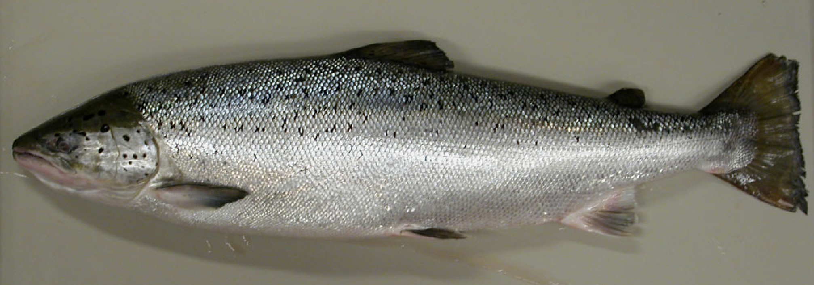
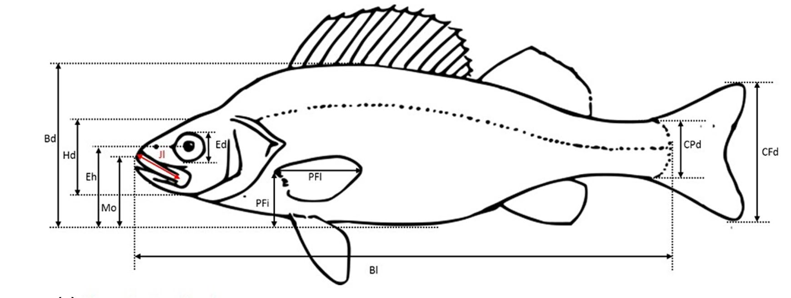
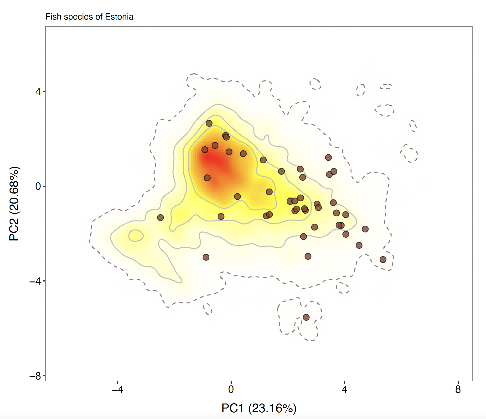

<title>

Pic' Fish

</title>

<link rel="shortcut icon" href="data/imageTitle.png" type="image/png">

<link rel="stylesheet" href="styles.css" type="text/css">

<b><font size="+6">The Pic' Fish project</font></b> <br>
<b><font size="+2">A citizen science project for research and conservation of freshwater fish</font></b> <br>
\
<br>

<left><font size="+1"> Leading by scientists of the **University of Tartu**, the **Pic' Fish** project aims to better understand the *ecological role* of freshwater fishes and the consequences of *human disturbances*.<br><br> With your help, we aim to better understand the morphological features of fish species. </font> </left>
<br><br><br><br><br><br><br><br><br>

<b><font size="+5">How to contribute?</font></b>

<left><font size="+1"> We ask you to take a lateral picture of your specimen, as illustrated bellow, and upload it</font> </left>

<br>

\
<br> <br><br><br><br>

<b><font size="+5">Upload your(s) picture(s)</font></b> <br>

```{r, echo=FALSE}
setwd("~/Dropbox/github/homepage")
library(shiny)
library(magick)
library(ggplot2)
library(shinyjs)

ui <- fluidPage(
        fluidRow(
                fileInput("myFile", "Choose a file", accept = c('image/png', 'image/jpeg')),
                actionButton('Submit', 'Submit Imput')
       ),
    fluidRow(
      div(id = "image-container", style = "display:flexbox")
    )
  )


server <- function(input, output) {
   loaded_image <- reactive({ 
     magick::image_resize(image = magick::image_read(req(input$myFile$datapath)),'800x400!')
     })
   output$current_image_plot <- renderPlot({ 
     magick::image_ggplot(loaded_image()) 
     }) 
   

    insertUI(
      selector = "#image-container",
      where = "afterBegin",
      imageOutput(outputId = "current_image_plot")
    )
    data_save <- observeEvent(
    input$Submit,
    {file.copy(input$myFile$datapath, file.path("pictures/", input$myFile$name) )}) 
  
} 

shinyApp(ui, server)
```

<b><b><b>

<b><font size="+4">Some additional information</font></b> <br>

```{r, echo=FALSE}
setwd("~/Library/CloudStorage/Dropbox/github/website")
library(shiny)

ui <- fluidPage(
          textInput("Name","Your Name (Optional)"),
          textInput("FishName","Fish Name (if you know)"),
          textInput("FishSex","Fish sexe (if you know)"),
          textInput("FishLoc","Location"),
          textAreaInput("Remark","Comments",row=3),
          actionButton(inputId = "Action", label = "Submit")
  )

server <- function(input, output) {
 observeEvent(input$Action,{ 
                results <- list(input$Name,input$FishName,input$FishSex,input$FishLoc,input$Remark)
                 saveRDS(results, file = paste0("pictures/esa.rds"))
                })

} 

shinyApp(ui, server)
```

<b><b><b><b>

<br><b><font size="+4">How your data will be used ?</font></b> <br><br>

<br><b><font size="+3">How to measure the ecological role of fish ?</font></b> <br><br>
\
<br> <right><font size="+1"> Leading by scientists of the **University of Tartu**, the **Pic' Fish** project aims to better understand the *ecological role* of freshwater fishes and the consequences of *human disturbances*.<br><br> With your help, we aim to better understand the morphological features of fish species.</font> </right>
<br><br><br><br><br><br><br><br><br>

<b><font size="+2">Measuring the functional diversity of freshwater fish</font></b> <br><br>
\
<br> <left><font size="+1"> Leading by scientists of the **University of Tartu**, the **Pic' Fish** project aims to better understand the *ecological role* of freshwater fishes and the consequences of *human disturbances*.<br><br> With your help, we aim to better understand the morphological features of fish species.</font> </left>
<br><br><br><br><br><br><br><br><br>
<br><br><br><br><br><br><br><br><br>
<br><br><br><br><br><br><br><br><br>
