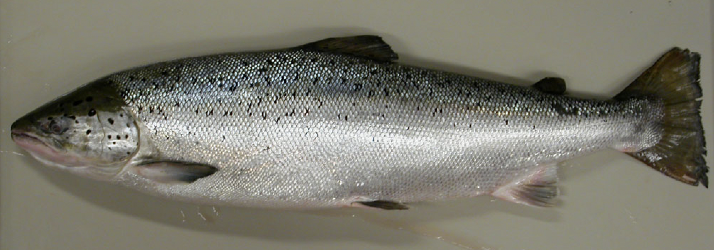
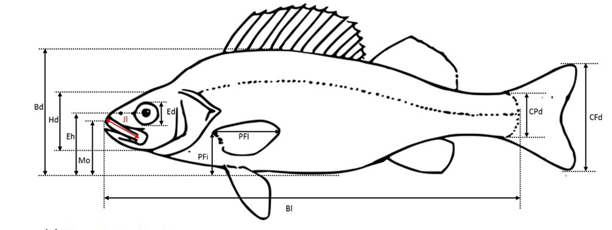
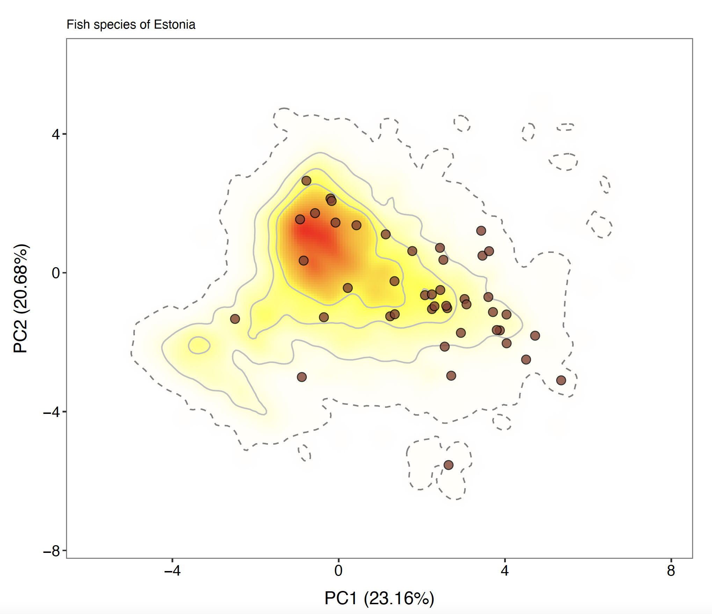

<title>Fish'in-Trait: intraspecific morphology of freshwater fish across
the world</title>

<link rel="stylesheet" href="styles.css" type="text/css">

<b>The Fish'in-Trait project</b>  
<b>A project for research and conservation of freshwater
fish</b>  \
 

<left> Leading by scientists of the **University of
Toulouse**, the **Fish'in-Trait** project aims to better understand the
*ecological role* of freshwater fishes and the consequences of *human
disturbances*.   With your help, we aim to better understand the
morphological features of fish species.  </left>
         

<b>How to contribute?</b>

here: <https://globaltrait.shinyapps.io/FishTRAIT/>

<left> We ask you to take a lateral picture of your
specimen, as illustrated bellow, and upload it </left>

 

\
      

 <b>How your data will be used ?</b>   

 <b>How to measure the ecological role of fish
?</b>   
\
  <right> Leading by scientists of the **University
of Toulouse**, the project aims to better understand the *ecological
role* of freshwater fishes and the consequences of *human
disturbances*.   With your help, we aim to better understand the
morphological features of fish species. </right>
         

<b>Measuring the functional diversity of freshwater
fish</b>   
\
