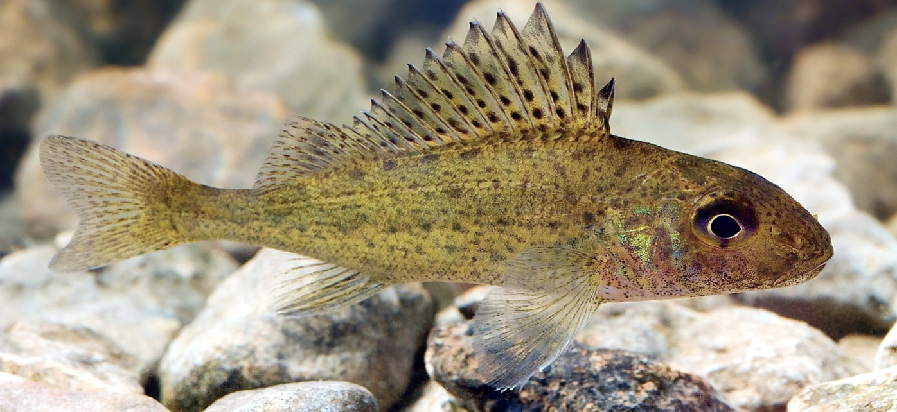
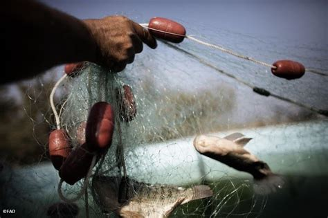
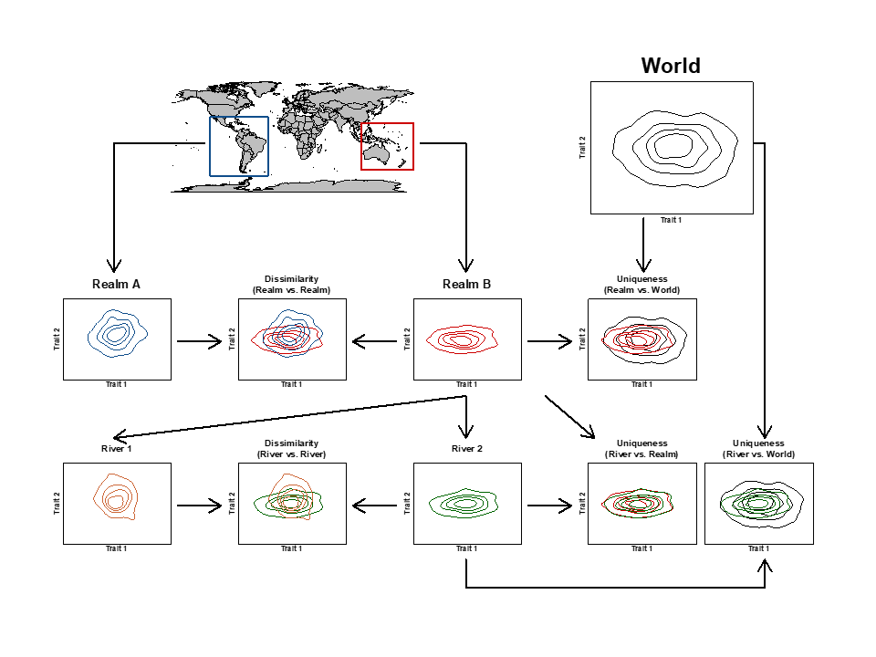
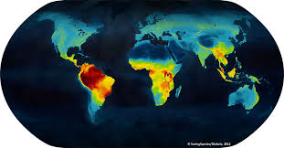
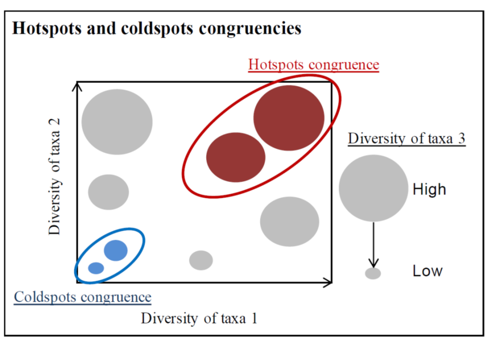
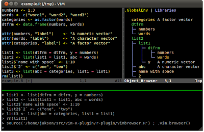

```{=html}
<title>Projects</title>
<link rel="shortcut icon" href="data/imageTitle.png" type="image/png">
<link rel="stylesheet" href="styles.css" type="text/css">

<style>
.project-section {
  display: flex;
  align-items: flex-start;
  gap: 24px;
  margin: 40px 0;
}

.project-section.reverse {
  flex-direction: row-reverse;
}

.project-img {
  width: 50%;
  flex-shrink: 0;
  border: 1px solid #ccc;
  border-radius: 4px;
}

.project-text {
  flex: 1;
}

.project-text h2 {
  font-size: 1.8em;
  margin-top: 0;
  margin-bottom: 12px;
}

.project-text p {
  font-size: 1.1em;
  line-height: 1.6;
  text-align: justify;
}

hr.project-divider {
  border: none;
  border-top: 1px solid #ddd;
  margin: 20px 0;
}
</style>

<!-- Project 1: Intra-specific morphological variation -->
<div class="project-section">
  
  <div class="project-text">
    <h2>Intra-specific morphological variation</h2>
    <p>
      The objective is to measure the variation of morphological traits within species 
      and understand the drivers of such variability across species. This project is 
      supported by Pierre Bertrand (Master Student, CRBE) and funded by 
      <em>CEBA</em> — details available 
      <a href="https://www.labex-ceba.fr/assets/projets-annuels-2025" target="_blank">here</a>.
    </p>
  </div>
</div>

<hr class="project-divider"/>

<!-- Project 2: Functional traits of species used by humans -->
<div class="project-section reverse">
  
  <div class="project-text">
    <h2>Functional traits of species used by humans</h2>
    <p>
      The objective is to measure the functional traits of species used by humans 
      to better assess conservation policies. This topic is developed by 
      Pierre Bouchet (PhD Student, CRBE).
    </p>
  </div>
</div>

<hr class="project-divider"/>

<!-- Project 3: Method comparison -->
<div class="project-section">
  
  <div class="project-text">
    <h2>Method comparison</h2>
    <p>
      The objective is to compare different approaches to the functional facet of 
      biodiversity and evaluate how they jointly provide new ways to refine assessments 
      of functional diversity patterns and the effect of human activity.
    </p>
  </div>
</div>

<hr class="project-divider"/>

<!-- Project 4: Global Functional Diversity -->
<div class="project-section reverse">
  
  <div class="project-text">
    <h2>Global Functional Diversity</h2>
    <p>
      This project aims to compile different databases of functional traits of plants 
      and vertebrates and to explore the macroecology of functional diversity among 
      taxonomic groups in the context of global change.
    </p>
  </div>
</div>

<hr class="project-divider"/>

<!-- Project 5: Cross-taxonomic diversity -->
<div class="project-section">
  
  <div class="project-text">
    <h2>Cross-taxonomic diversity</h2>
    <p>
      The objective of this project is to study the taxonomic and functional diversity 
      patterns of taxonomic groups representing contrasting ecosystem types and to 
      determine their congruence at global and biogeographical realm scales.
    </p>
  </div>
</div>

<hr class="project-divider"/>

<!-- Project 6: GIS application for conservation -->
<div class="project-section reverse">
  
  <div class="project-text">
    <h2>GIS application for conservation</h2>
    <p>
      The objective is to evaluate the conservation status of grasslands in Estonia. 
      This project was conducted under the supervision of 
      <a href="https://landscape.ut.ee/people/aveliina-helm/?lang=en" target="_blank">Dr. Aveliina Helm</a>. 
      Main contributions included the development of GIS and R algorithms for conservation 
      prioritization mapping, as well as algorithms for the 
      <a href="https://www.syke.fi/en-US/Research__Development/Nature/Specialist_work/Zonation_in_Finland/Zonation_software" target="_blank">Zonation software</a>.
    </p>
  </div>
</div>
```