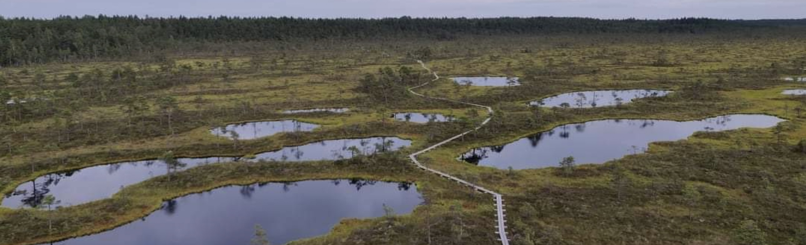
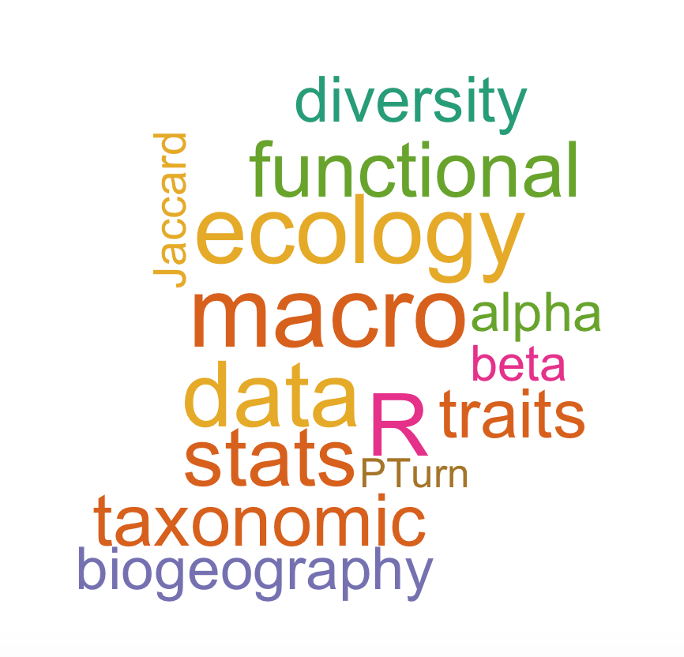
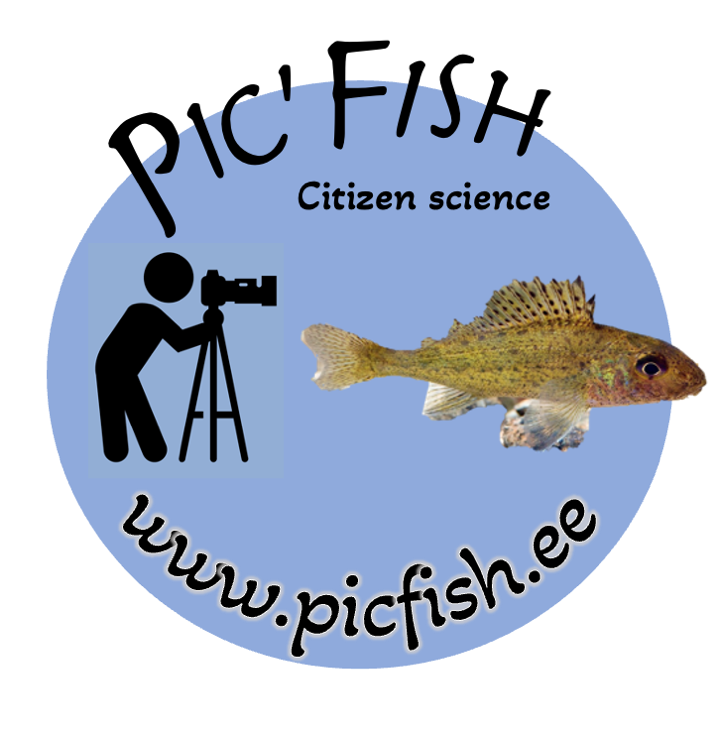

<title>Home</title>

<link rel="shortcut icon" href="data/imageTitle.png" type="image/png">

<link rel="stylesheet" href="styles.css" type="text/css">

<h1 align="center">

<b>**Aurèle Toussaint**</b>

</h1>

::: columns
::: {.column width="56%"}
**CNRS Researcher**

<u>Professional email:</u>  
!! NEW ADDRESS !! 
[aurele.toussaint\@univ-tlse3.fr](mailto:aurele.toussaint@univ-tlse3.fr){.email}  
!! NEW ADDRESS !!  
<u>Personal email:</u>
[toussaint.aurele\@gmail.com](mailto:toussaint.aurele@gmail.com){.email}

Full CV available [here](data/CV_Toussaint.pdf)  ResearchGate
<a href="https://www.researchgate.net/profile/Aurele_Toussaint" target="_blank">here</a> Google
scholar
<a href="https://scholar.google.fr/citations?user=oTxWHKgAAAAJ&hl=fr" target="_blank">here</a> 
ORCID
<a href="https://orcid.org/0000-0002-5738-4637" target="_blank">0000-0002-5738-4637</a> 
:::

::: {.column width="44%"}
<h3 align="left">

<b>Professional address</b>

</h3>

Centre de Recherche pour la Biodiversité et l'Environnement   UMR5300 - UPS-CNRS-IRD-INP  Université Paul-Sabatier - Toulouse 3 Bat. 4R1  118 Route de Narbonne 
31062, Toulouse  France 
:::
:::

<h2 align="left">

<b>Research</b>

</h2>

I work on ecological and evolutionary processes involved in the
distribution of functional traits mainly on plants and vertebrates.

<h2 align="left">

</h2>

<h2 align="left">

<b>Pic'Fish project</b>

</h2>

Join us and participate to our citizen campaign **Pic'Fish**. More
information [here]

<h2 align="center">

</h2>

 

<h1 align="center">

<b>Previous grants</b>

</h1>

*2020-2023* : **Research Fellow** supported by *the Estonian Research
Council (PSG-505)*
<a href="https://app.dimensions.ai/details/grant/grant.8855456" target="_blank">here</a>

*2017-2019* : **Post-doctoral Fellow** supported by *the Estonian
Research Council (MOBJD-276)*
<a href="https://app.dimensions.ai/details/grant/grant.7070239" target="_blank">here</a>

*2016* : **Erasmus MUNDUS** with the
<a href="https://www.khu.ac.kr/eng/main/index.do" target="_blank">Kyung
Hee University</a>, Seoul (Korea)

<h1 align="center">

<b>Publications</b>

</h1>

The below publications represent my work to date. A full list of
publications is available in
<a href="https://scholar.google.fr/citations?user=oTxWHKgAAAAJ&hl=fr" target="_blank">Google
Scholar</a> and
<a href="https://www.researchgate.net/profile/Aurele_Toussaint" target="_blank">Research
Gate</a>.

Data repository is available [here](RData.html)

## 2024

**24/** **Toussaint A.**, Pärtel M., Carmona C.P., Contrasting impacts
of non-native and threatened species on morphological, life-history, and
phylogenetic diversity in bird assemblages, *Ecology Letters*,27, e14373

## 2023

**23/** **Toussaint A.**, Pärtel M., Carmona C.P., Contrasting impacts
of non-native and threatened species on morphological, life-history, and
phylogenetic diversity in birds' assemblages, *Authorea*
<a href="data/2023_Toussaint_Authorea_2.pdf" target="_blank">PDF</a>

**22/** Coulon, N., Lindegren, M., Goberville, E., **Toussaint, A.**,
Receveur, A., & Auber, A., Threatened fish species in the Northeast
Atlantic are functionally rare. *Global Ecology and Biogeography*, 00,
1-19. <a href="data/2023_Coulon_GEB.pdf" target="_blank">PDF</a>

**21/** Bueno, C.G., **Toussaint, A.**, Träger, S. et al. Reply to: The
importance of trait selection in ecology. *Nature* 618, E31-E34.
<a href="data/2023_Bueno_nature.pdf" target="_blank">PDF</a>

**20/** **Toussaint A.**,Pärtel M.,Carmona C.P., Non-native bird species
will not compensate for the loss of phylogenetic and functional
diversity after the extinction of threatened species, *Authorea*
<a href="data/2023_Toussaint_Authorea.pdf" target="_blank">PDF</a>

**19/** de Tombeur, F., Raven, J. A., **Toussaint A.**, Lambers, H.,
Cooke, J., Hartley, S. E., Johnson, S. N., Coq, S., Katz, O., Schaller,
J. and Violle, C., Why do plants silicify? *Trends in Ecology and
Evolution*, 38(3), 275-288
<a href="data/2023_deTombeur.pdf" target="_blank">PDF</a>

## 2022

**18/** Auber A., Waldock C., Maire A., Goberville E., Albouy C., Algar
A.C., McLean M., Brind'Amour A., Green A.L., Tupper M., Vigliola L.,
Kaschner K., Kesner-Reyes K., Beger M., Tjiputra J, **Toussaint A.**,
Violle C., Mouquet N., Thuiller W., Mouillot D., A functional
vulnerability framework for biodiversity conservation, *Nature
Communications*, 13, 4774
<a href="data/2022_Auber_NatComms.pdf" target="_blank">PDF</a>

**17/** Paganeli B., **Toussaint A.**, Bueno C. G., Fujinuma J., Reier
Ü., Pärtel M., Dark diversity at home describes the success of
cross-continent tree invasions. *Diversity and Distributions*, 28 (6),
1202-1213 <a href="data/2022_Paganeli_DDI.pdf" target="_blank">PDF</a>

**16/** Su G.,Tedesco P.A., **Toussaint A.**, Villeger S., Brosse S.,
Contemporary environment and historical legacy explain functional
diversity of freshwater fishes in the world rivers, *Global Ecology and
Biogeography*, 31, 700-713
<a href="data/2022_Su_GEB.pdf" target="_blank">PDF</a>

## 2021

**15/** Brosse S., Charpin N., Su G., **Toussaint A.**, Herrera-R. G.A.,
Tedesco P.A., Villeger S., FISHMORPH: A global database on morphological
traits of freshwater fishes, *Global Ecology and Biogeography*, 30 (12),
2330-2336 <a href="data/2021_Brosse_GEB.pdf" target="_blank">PDF</a>

**14/** Carmona C.P., Bueno C.G., **Toussaint A.**, Träger S., Diaz S.,
Moora M., Munson D.A., Pärtel M., Zobel M., Tamme R., Fine-root traits
in the global spectrum of plant form and function, *Nature*, 597 (7878),
683-687 <a href="data/2021_Carmona_Nature.pdf" target="_blank">PDF</a>

**13/** **Toussaint A.**, Brosse S., Bueno C.G., Pärtel M., Tamme S.,
Carmona C.P., Extinction of threatened vertebrates will lead to
idiosyncratic changes in functional diversity across the world, *Nature
Communication*, 12 (1), 1-12
<a href="data/2021_Toussaint_NatCom.pdf" target="_blank">PDF</a>

**12/** Tordoni E., **Toussaint A.**, Pärtel M., Nogues-Bravo D.,
Carmona C.P., Combining taxonomic, phylogenetic and functional diversity
reveals new global priority areas for tetrapod conservation, *bioRxiv*,
<a href="https://doi.org/10.1101/2021.07.01.450689" target="_blank">doi:
https://doi.org/10.1101/2021.07.01.450689 </a>

**11/** Carmona C.P., Tamme R., Pärtel M., de Bello F., Brosse S.,
Capdevila P., Gonzalez-M R., Gonzalez-Suarez M., Salguero-Gomez R.,
Vasquez-Valderrama M., **Toussaint A.**, Erosion of global functional
diversity across the tree of life, *Science Advances*, 7(13), eabf2675
<a href="data/2021_Carmona_SciAdv.pdf" target="_blank">PDF</a>,
<a href="https://inee.cnrs.fr/fr/cnrsinfo/lextinction-des-especes-en-danger-entrainera-une-reorganisation-globale-du-role-des-autres" target="_blank">press
release CNRS</a>,
<a href="https://www.eurekalert.org/news-releases/546861" target="_blank">EurekAlert!</a>

## 2020

**10/** Carmona C.P., Tamme R., Partel M., de Bello F., Brosse S.,
Capdevila P., Gonzalez-M R., Gonzalez-Suarez M., Salguero-Gomez R.,
Vasquez-Valderrama M., **Toussaint A.**, Mapping extinction risk in the
global functional spectra across the tree of life, *bioRxiv*,
<a href="https://doi.org/10.1101/2020.06.29.179143" target="_blank">
doi:https://doi.org/10.1101/2020.06.29.179143 </a>
<a href="https://www.biorxiv.org/content/10.1101/2020.06.29.179143v1.abstract" target="_blank">PDF</a>

**9/** Derezal, O., Mondy P.C., Dembski S., Kreutzenberger K., Reyjol
Y., Chanderis A., Valette L., Brosse S., **Toussaint A.**, Beillard J.,
Merg M.L., Usseglio-Polatera P., A diagnostic-based approach to assess
specific risks of river degradation in a multiple pressure context:
Insights from fish communities. *Science of The Total Environment*, 734,
139467
<a href="data/2020_Derezal_et_al_STOTEN.pdf" target="_blank">PDF</a>

**8/** **Toussaint A.**, Bueno C.G., Davison J., Moora M., Tedersoo L.,
Zobel M., Opik M. & Partel M., Asymmetric patterns of global diversity
among plants and mycorrhizal fungi *Journal of Vegetation Science*,
31(2), 355-366
<a href="data/2019_Toussaint_JVS.pdf" target="_blank">PDF</a>

## 2018

**7/** **Toussaint A.**, Charpin N., Beauchard O., Grenouillet G.,
Oberdorff T., Tedesco P.A., Villéger S. & Brosse S. Non-native species
led to marked shifts in functional diversity of the world freshwater
fish faunas. *Ecology Letters*, 21(11), 1649-1659.
<a href="data/2018_Toussaint_Ecolet.pdf" target="_blank">PDF</a>,
<a href="http://www.cnrs.fr/inee/communication/breves/b405.html" target="_blank">press
release CNRS</a>,
<a href="http://www.ird.fr/toute-l-actualite/actualites-scientifiques/la-biodiversite-des-poissons-d-eau-douce-bouleverse" target="_blank">press
release IRD</a> in french and
<a href="https://ecolchange.wordpress.com/2018/10/11/new-publication-non-native-species-led-to-marked-shifts-in-functional-diversity-of-the-world-freshwater-fish-faunas" target="_blank">blog
post</a> in English.
<a href="data/ele13141-sup-0001-suppinfo.docx" target="_blank">Supplementary</a>

**6/** Kuczynski L., Côte J., **Toussaint A.**, Brosse S., Buisson L.,
Grenouillet G. Spatial mismatch in morphological, ecological and
phylogenetic diversity, in historical and contemporary European
freshwater fish faunas. *Ecography*, 41, 1665-1674.
<a href="data/2018_Kuczinski_et_al_Ecography.pdf" target="_blank">PDF</a>

**5/** Tedersoo L., Laanisto L., Rahimlou S., **Toussaint A.**, Hallikma
T., Pärtel M. Global database of plants with root‐symbiotic nitrogen
fixation: Nod DB. *Journal of Vegetation Science*, 29(3), 560-568
<a href="data/2018_Tedersoo_JVS.pdf" target="_blank">PDF</a>

## 2016

**4/** **Toussaint A.**, Charpin N., Brosse S. & Villéger S. Global
functional diversity of freshwater fish is concentrated in the
Neotropics. *Scientific Report*, 6, 22125.
<a href="data/2016_Toussaint_SciRep.pdf" target="_blank">PDF</a>, \<a
href="<http://www.cnrs.fr/inee/communication/breves/b178.html>"
target="\_blank"\>press release</a> in french and
<a href="https://www.franceinter.fr/emissions/la-tete-au-carre/la-tete-au-carre-11-avril-2016" target="_blank">Radio
show</a> (*La tête au carré*, France Inter, 11/04/2016)
[Supplementary](data/srep22125-s1.docx)

**3/** **Toussaint A.**, Beauchard O., Oberdorff T., Brosse S. &
Villeger S. Worldwide freshwater fish homogenization is driven by a few
widespread non-native species. *Biological Invasions*, 18, 1295-1304.
<a href="data/2016_Toussaint_BiologicalInvasions.pdf" target="_blank">PDF</a>

## 2015

**2/** Allard L., **Toussaint A.**, Vigouroux R. & Brosse S.
Length-weight relationship of 58 fish species in streams of French
Guiana. *Journal of Applied Ichthyology*, 31, 567-570.
<a href="data/2016_Toussaint_BiologicalInvasions.pdf" target="_blank">PDF</a>

## 2014

**1/** **Toussaint A.**, Beauchard O., Oberdorff T., Brosse S., Villéger
S. Historical assemblage distinctiveness and the introduction of
widespread non-native species explain worldwide changes in freshwater
fish taxonomic dissimilarity. *Global Ecology and Biogeography*, 23,
574-584.
<a href="data/2014_Toussaint%20et%20al._GEB.pdf" target="_blank">PDF</a>
and
<a href="https://www.cnrs.fr/occitanie-ouest/CNRS-Hebdo/Actualites/18686/Suite.aspx" target="_blank">CNRS
press release</a>, [Supplementary1](data/geb12141-sup-0001-si.doc);
[Supplementary2](data/geb12141-sup-0002-si.doc)

<h1 align="center">

<b>Communication</b>

</h1>

2020 Annual meeting for macroecology of the ecological society of
Germany Austria and Switzerland, Konstanz, Germany: *Mapping extinction
risk in the global functional spectra across the tree of life*

2018 Annual meeting for macroecology of the ecological society of
Germany Austria and Switzerland, Birmendorf, Switzerland: *Global
mismatch between the species richness of vascular plants and symbiosis
fungi*

2017 60th IAVS Annual Symposium, Palermo, Italy: *Global mismatch
between the species richness of vascular plants and symbiosis fungi
across biogeographic realms*

2016 7th EAFES International Congress, Daegu, South-Korea: *Functional
diversity and vulnerability of freshwater fish at the global scale*

2015 9th Symposium for European freshwater sciences, Geneva,
Switzerland: *Introductions of non-natives freshwater fish affected
differently the taxonomic and functional biodiversity facets*

2015 7th Biennal conference of the International Biogeography Society,
Bayreuth, Germany : *Functional diversity of the freshwater fish fauna*
(poster)

2013 8th Symposium for European freshwater sciences, Munster, Germany:
*Historical assemblage distinctiveness and the introduction of
widespread non-native species explain worldwide changes in freshwater
fish taxonomic dissimilarity*

<h1 align="center">

<b>PhD Thesis</b>

</h1>

During my PhD, I investigated functional diversity of freshwater fishes
at the world scale under the advisement of <a
href="http://brosse.sebastien.free.fr" target="_blank">Pr. Sébastien
Brosse</a> and
<a href="https://scholar.google.fr/citations?hl=fr&user=vLK2CbwAAAAJ&view_op=list_works&sortby=pubdate" target="_blank">Dr.
Sébastien Villéger</a>

**Toussaint A.** 2016. Diversité fonctionnelle des poissons d'eau douce
à l'échelle mondiale: patrons, déterminants et impacts des activité
humaines. Université de Toulouse. 223p.
<a href="data/Toussaint_2016_These.pdf" target="_blank">PDF</a> (in
french only)

## Detailed thesis abstract in English

Biodiversity is often characterized only through its taxonomic facet,
i.e. the number and list of species present in assemblages. However,
recent studies show that biodiversity can not be summarized only by this
facet because it does not reflect the ecological characteristics of the
species. Several facets can describe biodiversity as functional
diversity that allows considering the ecological traits of species and
thus their role in ecosystem functioning. However, few studies have
described this facet of biodiversity at large scale, its links with the
taxonomic diversity and its responses to global change. The objectives
of this thesis is to 1) describe and understand the distribution of the
functional diversity of freshwater fish assemblages at the global scale
and 2) quantify the consequences of human activities on both taxonomic
and functional biodiversity facets. Towards these aims we have built a
morphological traits database for more than 9,000 species of freshwater
fish occurring in more than 1,000 river basins across the world. We have
demonstrated that functional diversity is unequally distributed across
the world and weakly related to the taxonomic diversity at global scale.
For example, species-rich Neotropical rivers host more than 75% of the
global functional diversity whereas the African or Asian rivers, also
rich in species, host less than a quarter of the world functional
diversity. Such a situation is explained by the functional uniqueness
supported by some species of Neotropical fish orders that contribute to
increase the functional diversity of this region. The functional
diversity of the different biogeographic realms is also unequally
vulnerable to extinction of endangered species, as Europe or North
America could lose between 35% and 45% of their functional diversity,
while the Neotropical realm appears less sensitive with only 10% of its
functional diversity supported by vulnerable species. We also showed
that the introduction of non-native species in many river basins across
the world have contributed to profoundly changing the historical
patterns of biodiversity. Indeed, species introductions have promoted a
taxonomic homogenization of fish faunas across the world accompanied by
a decrease in the number of unique species in the poorest assemblages.
This change is largely due to the overriding effects of few non-native
species largely introduced worldwide. In addition, non-native species
have contributed to significantly increase the functional diversity of
assemblages by 150% on average, up to 7 times greater than that reported
for taxonomic diversity (20% on average). This demonstrates the high
sensitivity of the functional diversity of fish assemblages face to
changes in species composition and the need to consider the functional
diversity for understanding the impact of current and future human
activities. These results contribute to the knowledge on the
biodiversity of the richest vertebrate clade and therefore have
implications in terms of biodiversity conservation and management of
freshwater ecosystems.
