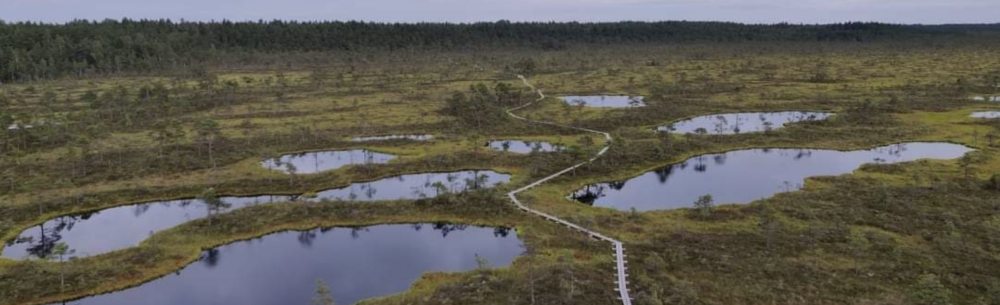
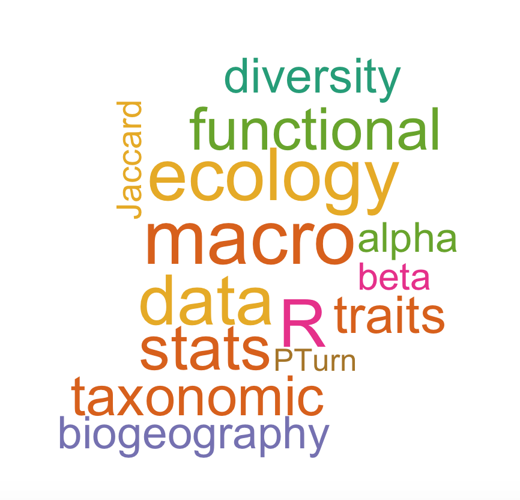

```{=html}
<link rel="shortcut icon" href="data/imageTitle.png" type="image/png">
<link rel="stylesheet" href="styles.css" type="text/css">

<style>
/* ── Layout ─────────────────────────────────────────── */
.profile-grid {
  display: flex;
  gap: 40px;
  align-items: flex-start;
  margin: 30px 0;
}

.profile-affiliation {
  flex: 0 0 60%;
}

.profile-metrics {
  flex: 1;
}

/* ── Section titles (picked up by TOC) ──────────────── */
h1.section-title {
  text-align: center;
  font-size: 1.8em;
  font-weight: bold;
  margin: 40px 0 16px 0;
  border-bottom: 1px solid #ddd;
  padding-bottom: 6px;
}

/* ── Page title ─────────────────────────────────────── */
.page-title {
  text-align: center;
  font-size: 2.4em;
  font-weight: bold;
  margin-bottom: 4px;
}

.page-subtitle {
  font-size: 1.3em;
  font-weight: bold;
  margin: 8px 0 20px 0;
}

/* ── Publications ───────────────────────────────────── */
.pub-list {
  counter-reset: pub-counter 30;
  list-style: none;
  padding: 0;
}

.pub-list li {
  counter-increment: pub-counter -1;
  padding: 6px 0 6px 48px;
  position: relative;
  line-height: 1.5;
  border-bottom: 1px solid #f0f0f0;
}

.pub-list li::before {
  content: counter(pub-counter) "/";
  position: absolute;
  left: 0;
  font-weight: bold;
  color: #555;
  width: 40px;
  text-align: right;
}

.pub-list li.pub-year-label {
  counter-increment: none;
  font-size: 1.2em;
  font-weight: bold;
  color: #333;
  padding: 20px 0 4px 0;
  border-bottom: none;
}

.pub-list li.pub-year-label::before {
  content: none;
}
.pub-year {
  font-size: 1.2em;
  font-weight: bold;
  margin: 24px 0 8px 0;
  color: #333;
}

/* ── Students ───────────────────────────────────────── */
.student-list {
  list-style: none;
  padding: 0;
}

.student-list li {
  padding: 5px 0;
  border-bottom: 1px solid #f0f0f0;
  line-height: 1.5;
}

/* ── Grants ─────────────────────────────────────────── */
.grant-item {
  margin: 10px 0;
  padding: 10px 14px;
  border-left: 3px solid #aaa;
  background: #fafafa;
  line-height: 1.6;
}

/* ── Conferences ────────────────────────────────────── */
.conf-list {
  list-style: none;
  padding: 0;
}

.conf-list li {
  padding: 6px 0;
  border-bottom: 1px solid #f0f0f0;
  line-height: 1.5;
}

/* ── Wordcloud ──────────────────────────────────────── */
.wordcloud-wrap {
  text-align: center;
  margin: 20px 0;
}

.wordcloud-wrap img {
  width: 45%;
  border: none;
  border-radius: 4px;
}
</style>

<!-- ══════════════════════════════════════════════════ -->
<!--  HEADER                                           -->
<!-- ══════════════════════════════════════════════════ -->

<p class="page-title">Aurèle Toussaint</p>



<p class="page-subtitle">Chargé de recherche (CR) / Researcher</p>

<!-- ══════════════════════════════════════════════════ -->
<!--  AFFILIATION + METRICS                            -->
<!-- ══════════════════════════════════════════════════ -->

<div class="profile-grid">

  <div class="profile-affiliation">
    
    <p>
      <strong>Centre de Recherche sur la Biodiversité et l'Environnement</strong><br>
      UMR5300 — UPS · CNRS · IRD · INP<br>
      Université de Toulouse<br>
      Bât. 4R1, bureau 29<br>
      118 Route de Narbonne<br>
      31062 Toulouse, France<br>
      <a href="https://crbe.cnrs.fr/" target="_blank">Website</a>
    </p>
  </div>

  <div class="profile-metrics">
    <h3>Metrics</h3>
    <p>
      Full CV available <a href="data/CV_Toussaint.pdf" target="_blank">here</a><br>
      <a href="https://www.researchgate.net/profile/Aurele_Toussaint" target="_blank">ResearchGate</a><br>
      <a href="https://scholar.google.fr/citations?user=oTxWHKgAAAAJ&hl=fr" target="_blank">Google Scholar</a><br>
      ORCID: <a href="https://orcid.org/0000-0002-5738-4637" target="_blank">0000-0002-5738-4637</a>
    </p>
    <h3>Contact</h3>
    <p>
      <a href="mailto:aurele.toussaint@cnrs.fr">aurele.toussaint@cnrs.fr</a><br>
      <a href="mailto:aurele.toussaint@utoulouse.fr">aurele.toussaint@utoulouse.fr</a>
    </p>
  </div>

</div>

<!-- ══════════════════════════════════════════════════ -->
<!--  RESEARCH                                         -->
<!-- ══════════════════════════════════════════════════ -->

<h1 class="section-title">Research</h1>

<p>
  My research sits at the interface of macroecology, functional ecology, and 
  conservation biology, with a focus on understanding how the functional diversity 
  of vertebrates and plants is distributed across the globe, what processes 
  generate and maintain these patterns, and how anthropogenic pressures are 
  reshaping them.
</p>

<p>
  A central theme of my work is the <strong>functional diversity of freshwater 
  fishes</strong>. During my PhD and subsequent projects, I built one of the 
  largest morphological trait databases for freshwater fishes, covering more than 
  9,000 species across more than 1,000 river basins worldwide. This work revealed 
  that functional diversity is highly concentrated in the Neotropics — which host 
  more than 75% of global functional diversity — and is only weakly correlated 
  with species richness at macroecological scales. I showed that the introduction 
  of non-native species has fundamentally restructured the functional composition 
  of fish assemblages worldwide, increasing functional diversity by up to 150% on 
  average while simultaneously driving taxonomic homogenization through the 
  dominance of a few widespread invasive species.
</p>

<p>
  A second major axis of my research concerns the <strong>consequences of 
  biodiversity loss</strong> for functional diversity. I have demonstrated that 
  the extinction of threatened vertebrates will not lead to uniform losses of 
  functional diversity, but rather to idiosyncratic changes that vary 
  substantially across biogeographic realms and taxonomic groups. In birds, I 
  showed that non-native species will not compensate for the functional and 
  phylogenetic diversity lost following the extinction of threatened species, 
  highlighting the irreplaceable role of native biodiversity in sustaining 
  ecosystem functioning. This work contributed to a broader programme on the 
  erosion of functional diversity across the tree of life, which demonstrated 
  that extinction risk is non-randomly distributed in functional trait space 
  and that threatened species disproportionately occupy unique functional 
  positions.
</p>

<p>
  More recently, I have been investigating <strong>intraspecific trait 
  variability</strong> as a neglected but critical component of functional 
  diversity. The INTRAIT project, supported by CEBA and TREMPLIN, aims to 
  quantify morphological variation within freshwater fish species in French 
  Guiana and to assess how ignoring this variability biases community-level 
  estimates of functional diversity. This work bridges individual-level 
  phenotypic variation and macroecological patterns, and is carried out in 
  close collaboration with master and PhD students at CRBE.
</p>

<p>
  Across all these research axes, I employ a combination of <strong>large-scale 
  trait databases, multivariate statistics, and simulation approaches</strong> 
  implemented in R. I am particularly interested in methodological questions 
  surrounding the measurement and comparison of functional diversity indices, 
  and in developing reproducible analytical pipelines for handling large 
  biodiversity datasets. My work has been published in leading international 
  journals including <em>Nature</em>, <em>Nature Communications</em>, 
  <em>Science Advances</em>, <em>Ecology Letters</em>, and 
  <em>Global Ecology and Biogeography</em>.
</p>

<div class="wordcloud-wrap">
  
</div>

<!-- ══════════════════════════════════════════════════ -->
<!--  CURRENT GRANTS                                   -->
<!-- ══════════════════════════════════════════════════ -->

<h1 class="section-title">Current grants</h1>

<div class="grant-item">
  <em>2025–2026</em> &nbsp;|&nbsp; <strong>INTRAIT</strong> — Influence of Intraspecific trait variability on the functional diversity of fish communities in French Guiana.<br>
  Supported by <em>CEBA</em> <a href="https://www.labex-ceba.fr/assets/projets-annuels-2025" target="_blank">here</a>
  and <em>TREMPLIN</em> <a href="https://www.labex-ceba.fr/assets/projets-annuels-2025" target="_blank">here</a>.
</div>

<!-- ══════════════════════════════════════════════════ -->
<!--  PREVIOUS GRANTS                                  -->
<!-- ══════════════════════════════════════════════════ -->

<h1 class="section-title">Previous grants</h1>

<div class="grant-item">
  <em>2026</em> &nbsp;|&nbsp; <strong>Lauréat du réseau de chaires du CFBBA</strong> - Building an Intraspecific Trait Database for Amazonian Freshwater Fishes<br>
  Supported by <em>CFBBA</em> <a href="https://cfbbamazonia.org/fr/" target="_blank">here</a>.
</div>

<div class="grant-item">
  <em>2020–2023</em> &nbsp;|&nbsp; <strong>Research Fellow</strong> — Estonian Research Council (PSG-505).
  <a href="https://app.dimensions.ai/details/grant/grant.8855456" target="_blank">Details</a>
</div>. 

<div class="grant-item">
  <em>2017–2019</em> &nbsp;|&nbsp; <strong>Post-doctoral Fellow</strong> — Estonian Research Council (MOBJD-276).
  <a href="https://app.dimensions.ai/details/grant/grant.7070239" target="_blank">Details</a>
</div>

<div class="grant-item">
  <em>2016</em> &nbsp;|&nbsp; <strong>Erasmus MUNDUS</strong> —
  <a href="https://www.khu.ac.kr/eng/main/index.do" target="_blank">Kyung Hee University</a>, Seoul, Korea.
</div>

<!-- ══════════════════════════════════════════════════ -->
<!--  PUBLICATIONS                                     -->
<!-- ══════════════════════════════════════════════════ -->

<h1 class="section-title">Publications</h1>

<p>A full list is available on
<a href="https://scholar.google.fr/citations?user=oTxWHKgAAAAJ&hl=fr" target="_blank">Google Scholar</a> and
<a href="https://www.researchgate.net/profile/Aurele_Toussaint" target="_blank">ResearchGate</a>.
Data repository available <a href="RData.html">here</a>.</p>

<ol class="pub-list">

  <li class="pub-year-label">2025</li>

  <li>
    Partel M., Tamme R., …, <strong>Toussaint A.</strong>, …, Zobel M.
    Global impoverishment of natural vegetation revealed by dark diversity.
    <em>Nature</em>, 641, 917–924.
    <a href="data/2025_Partel_Nature.pdf" target="_blank">PDF</a> ·
    <a href="https://www.inee.cnrs.fr/fr/cnrsinfo/la-diversite-fantome-ou-dark-diversity-revele-limpact-mondial-des-activites-humaines-sur" target="_blank">Press release CNRS</a> ·
    <a href="https://crbe.cnrs.fr/la-diversite-fantome-ou-dark-diversity-revele-limpact-mondial-des-activites-humaines-sur-la-biodiversite" target="_blank">Actualité CRBE</a> ·
    <a href="https://www.eurekalert.org/news-releases/1078990" target="_blank">EurekAlert</a>
  </li>

  <li>
    Chen Z., Xu C., Brosse S., <strong>Toussaint A.</strong>, Xu J., Su G.
    Global Patterns and Determinants of Multiple Facets of Freshwater Fishes Beta Diversity.
    <em>Global Ecology and Biogeography</em>.
    <a href="data/2025_Chen_GEB.pdf" target="_blank">PDF</a>
  </li>

  <li class="pub-year-label">2024</li>

  <li>
    <strong>Toussaint A.</strong>, Pärtel M., Carmona C.P.
    Contrasting impacts of non-native and threatened species on morphological, life-history, and phylogenetic diversity in bird assemblages.
    <em>Ecology Letters</em>, 27, e14373.
    <a href="data/2024_Toussaint_EcolLett.pdf" target="_blank">PDF</a>
  </li>

  <li>
    Tordoni E., Carmona C.P., <strong>Toussaint A.</strong>, Tamme R., Pärtel M.
    Global patterns and determinants of multiple facets of plant diversity.
    <em>Global Ecology and Biogeography</em>, e13823.
    <a href="data/2024_Tordoni_GEB.pdf" target="_blank">PDF</a>
  </li>

  <li>
    Carmona C.P., Pärtel M., Tamme R., <strong>Toussaint A.</strong>
    OTSIMAS ELURIKKUSE MÕÕTMEID LOOMADE JA TAIMEDE SEAST, MAA ALT JA MAA PEALT.
    <em>EESTI VABARIIGI PREEMIAD</em>.
    <a href="data/2024_Carmona_EESTI.pdf" target="_blank">PDF</a>
  </li>

  <li>
    Coulon N., Pilet S., Lizé A., Lacoue-Labarthe T., Sturbois A., <strong>Toussaint A.</strong>, Feunteun E., Carpentier A.
    Shark critical life stage vulnerability to monthly temperature variations under climate change.
    <em>Marine Environmental Research</em>, 198, 106531.
    <a href="data/2024_Coulon_MER.pdf" target="_blank">PDF</a>
  </li>

  <li class="pub-year-label">2023</li>

  <li>
    <strong>Toussaint A.</strong>, Pärtel M., Carmona C.P.
    Contrasting impacts of non-native and threatened species on morphological, life-history, and phylogenetic diversity in birds' assemblages.
    <em>Authorea</em>.
    <a href="data/2023_Toussaint_Authorea_2.pdf" target="_blank">PDF</a>
  </li>

  <li>
    Coulon N., Lindegren M., Goberville E., <strong>Toussaint A.</strong>, Receveur A., Auber A.
    Threatened fish species in the Northeast Atlantic are functionally rare.
    <em>Global Ecology and Biogeography</em>, 1–19.
    <a href="data/2023_Coulon_GEB.pdf" target="_blank">PDF</a>
  </li>

  <li>
    Bueno C.G., <strong>Toussaint A.</strong>, Träger S. et al.
    Reply to: The importance of trait selection in ecology.
    <em>Nature</em>, 618, E31–E34.
    <a href="data/2023_Bueno_nature.pdf" target="_blank">PDF</a>
  </li>

  <li>
    <strong>Toussaint A.</strong>, Pärtel M., Carmona C.P.
    Non-native bird species will not compensate for the loss of phylogenetic and functional diversity after the extinction of threatened species.
    <em>Authorea</em>.
    <a href="data/2023_Toussaint_Authorea.pdf" target="_blank">PDF</a>
  </li>

  <li>
    de Tombeur F., Raven J.A., <strong>Toussaint A.</strong>, Lambers H., Cooke J., Hartley S.E., Johnson S.N., Coq S., Katz O., Schaller J., Violle C.
    Why do plants silicify?
    <em>Trends in Ecology and Evolution</em>, 38(3), 275–288.
    <a href="data/2023_deTombeur.pdf" target="_blank">PDF</a>
  </li>

  <li class="pub-year-label">2022</li>

  <li>
    Auber A., Waldock C., Maire A., Goberville E., Albouy C., Algar A.C., McLean M., Brind'Amour A., Green A.L., Tupper M., Vigliola L., Kaschner K., Kesner-Reyes K., Beger M., Tjiputra J., <strong>Toussaint A.</strong>, Violle C., Mouquet N., Thuiller W., Mouillot D.
    A functional vulnerability framework for biodiversity conservation.
    <em>Nature Communications</em>, 13, 4774.
    <a href="data/2022_Auber_NatComms.pdf" target="_blank">PDF</a>
  </li>

  <li>
    Paganeli B., <strong>Toussaint A.</strong>, Bueno C.G., Fujinuma J., Reier Ü., Pärtel M.
    Dark diversity at home describes the success of cross-continent tree invasions.
    <em>Diversity and Distributions</em>, 28(6), 1202–1213.
    <a href="data/2022_Paganeli_DDI.pdf" target="_blank">PDF</a>
  </li>

  <li>
    Su G., Tedesco P.A., <strong>Toussaint A.</strong>, Villeger S., Brosse S.
    Contemporary environment and historical legacy explain functional diversity of freshwater fishes in the world rivers.
    <em>Global Ecology and Biogeography</em>, 31, 700–713.
    <a href="data/2022_Su_GEB.pdf" target="_blank">PDF</a>
  </li>

  <li class="pub-year-label">2021</li>

  <li>
    Carmona C.P., Tamme R., Pärtel M., de Bello F., Brosse S., Capdevila P., Gonzalez-M R., Gonzalez-Suarez M., Salguero-Gomez R., Vasquez-Valderrama M., <strong>Toussaint A.</strong>
    Erosion of global functional diversity across the tree of life.
    <em>Science Advances</em>, 7(13), eabf2675.
    <a href="data/2021_Carmona_SciAdv.pdf" target="_blank">PDF</a> ·
    <a href="https://inee.cnrs.fr/fr/cnrsinfo/lextinction-des-especes-en-danger-entrainera-une-reorganisation-globale-du-role-des-autres" target="_blank">Press release CNRS</a> ·
    <a href="https://www.eurekalert.org/news-releases/546861" target="_blank">EurekAlert!</a>
  </li>

  <li>
    Tordoni E., <strong>Toussaint A.</strong>, Pärtel M., Nogues-Bravo D., Carmona C.P.
    Combining taxonomic, phylogenetic and functional diversity reveals new global priority areas for tetrapod conservation.
    <em>bioRxiv</em>.
    <a href="https://doi.org/10.1101/2021.07.01.450689" target="_blank">doi: 10.1101/2021.07.01.450689</a>
  </li>

  <li>
    <strong>Toussaint A.</strong>, Brosse S., Bueno C.G., Pärtel M., Tamme S., Carmona C.P.
    Extinction of threatened vertebrates will lead to idiosyncratic changes in functional diversity across the world.
    <em>Nature Communications</em>, 12(1), 1–12.
    <a href="data/2021_Toussaint_NatCom.pdf" target="_blank">PDF</a>
  </li>

  <li>
    Carmona C.P., Bueno C.G., <strong>Toussaint A.</strong>, Träger S., Diaz S., Moora M., Munson D.A., Pärtel M., Zobel M., Tamme R.
    Fine-root traits in the global spectrum of plant form and function.
    <em>Nature</em>, 597(7878), 683–687.
    <a href="data/2021_Carmona_Nature.pdf" target="_blank">PDF</a>
  </li>

  <li>
    Brosse S., Charpin N., Su G., <strong>Toussaint A.</strong>, Herrera-R. G.A., Tedesco P.A., Villeger S.
    FISHMORPH: A global database on morphological traits of freshwater fishes.
    <em>Global Ecology and Biogeography</em>, 30(12), 2330–2336.
    <a href="data/2021_Brosse_GEB.pdf" target="_blank">PDF</a>
  </li>

  <li class="pub-year-label">2020</li>

  <li>
    <strong>Toussaint A.</strong>, Bueno C.G., Davison J., Moora M., Tedersoo L., Zobel M., Opik M., Partel M.
    Asymmetric patterns of global diversity among plants and mycorrhizal fungi.
    <em>Journal of Vegetation Science</em>, 31(2), 355–366.
    <a href="data/2019_Toussaint_JVS.pdf" target="_blank">PDF</a>
  </li>

  <li>
    Derezal O., Mondy P.C., Dembski S., Kreutzenberger K., Reyjol Y., Chanderis A., Valette L., Brosse S., <strong>Toussaint A.</strong>, Beillard J., Merg M.L., Usseglio-Polatera P.
    A diagnostic-based approach to assess specific risks of river degradation in a multiple pressure context: Insights from fish communities.
    <em>Science of The Total Environment</em>, 734, 139467.
    <a href="data/2020_Derezal_et_al_STOTEN.pdf" target="_blank">PDF</a>
  </li>

  <li>
    Carmona C.P., Tamme R., Partel M., de Bello F., Brosse S., Capdevila P., Gonzalez-M R., Gonzalez-Suarez M., Salguero-Gomez R., Vasquez-Valderrama M., <strong>Toussaint A.</strong>
    Mapping extinction risk in the global functional spectra across the tree of life.
    <em>bioRxiv</em>.
    <a href="https://doi.org/10.1101/2020.06.29.179143" target="_blank">doi: 10.1101/2020.06.29.179143</a>
  </li>

  <li class="pub-year-label">2018</li>

  <li>
    Tedersoo L., Laanisto L., Rahimlou S., <strong>Toussaint A.</strong>, Hallikma T., Pärtel M.
    Global database of plants with root-symbiotic nitrogen fixation: Nod DB.
    <em>Journal of Vegetation Science</em>, 29(3), 560–568.
    <a href="data/2018_Tedersoo_JVS.pdf" target="_blank">PDF</a>
  </li>

  <li>
    Kuczynski L., Côte J., <strong>Toussaint A.</strong>, Brosse S., Buisson L., Grenouillet G.
    Spatial mismatch in morphological, ecological and phylogenetic diversity in historical and contemporary European freshwater fish faunas.
    <em>Ecography</em>, 41, 1665–1674.
    <a href="data/2018_Kuczinski_et_al_Ecography.pdf" target="_blank">PDF</a>
  </li>

  <li>
    <strong>Toussaint A.</strong>, Charpin N., Beauchard O., Grenouillet G., Oberdorff T., Tedesco P.A., Villéger S., Brosse S.
    Non-native species led to marked shifts in functional diversity of the world freshwater fish faunas.
    <em>Ecology Letters</em>, 21(11), 1649–1659.
    <a href="data/2018_Toussaint_Ecolet.pdf" target="_blank">PDF</a> ·
    <a href="http://www.cnrs.fr/inee/communication/breves/b405.html" target="_blank">Press release CNRS</a> ·
    <a href="http://www.ird.fr/toute-l-actualite/actualites-scientifiques/la-biodiversite-des-poissons-d-eau-douce-bouleverse" target="_blank">Press release IRD</a> ·
    <a href="https://ecolchange.wordpress.com/2018/10/11/new-publication-non-native-species-led-to-marked-shifts-in-functional-diversity-of-the-world-freshwater-fish-faunas" target="_blank">Blog post</a> ·
    <a href="data/ele13141-sup-0001-suppinfo.docx" target="_blank">Supplementary</a>
  </li>

  <li class="pub-year-label">2016</li>

  <li>
    <strong>Toussaint A.</strong>, Beauchard O., Oberdorff T., Brosse S., Villeger S.
    Worldwide freshwater fish homogenization is driven by a few widespread non-native species.
    <em>Biological Invasions</em>, 18, 1295–1304.
    <a href="data/2016_Toussaint_BiologicalInvasions.pdf" target="_blank">PDF</a>
  </li>

  <li>
    <strong>Toussaint A.</strong>, Charpin N., Brosse S., Villéger S.
    Global functional diversity of freshwater fish is concentrated in the Neotropics.
    <em>Scientific Reports</em>, 6, 22125.
    <a href="data/2016_Toussaint_SciRep.pdf" target="_blank">PDF</a> ·
    <a href="http://www.cnrs.fr/inee/communication/breves/b178.html" target="_blank">Press release CNRS</a> ·
    <a href="https://www.franceinter.fr/emissions/la-tete-au-carre/la-tete-au-carre-11-avril-2016" target="_blank">Radio (France Inter, 11/04/2016)</a> ·
    <a href="data/srep22125-s1.docx" target="_blank">Supplementary</a>
  </li>

  <li class="pub-year-label">2015</li>

  <li>
    Allard L., <strong>Toussaint A.</strong>, Vigouroux R., Brosse S.
    Length-weight relationship of 58 fish species in streams of French Guiana.
    <em>Journal of Applied Ichthyology</em>, 31, 567–570.
    <a href="data/2016_Toussaint_BiologicalInvasions.pdf" target="_blank">PDF</a>
  </li>

  <li class="pub-year-label">2014</li>

  <li>
    <strong>Toussaint A.</strong>, Beauchard O., Oberdorff T., Brosse S., Villéger S.
    Historical assemblage distinctiveness and the introduction of widespread non-native species explain worldwide changes in freshwater fish taxonomic dissimilarity.
    <em>Global Ecology and Biogeography</em>, 23, 574–584.
    <a href="data/2014_Toussaint%20et%20al._GEB.pdf" target="_blank">PDF</a> ·
    <a href="https://www.cnrs.fr/occitanie-ouest/CNRS-Hebdo/Actualites/18686/Suite.aspx" target="_blank">Press release CNRS</a> ·
    <a href="data/geb12141-sup-0001-si.doc" target="_blank">Supplementary 1</a> ·
    <a href="data/geb12141-sup-0002-si.doc" target="_blank">Supplementary 2</a>
  </li>

</ol>
<!-- ══════════════════════════════════════════════════ -->
<!--  STUDENT SUPERVISION                              -->
<!-- ══════════════════════════════════════════════════ -->

<h1 class="section-title">Student supervision</h1>

<ul class="student-list">
  <li><strong>Adrien Lagalle.</strong> <em>Master.</em> 2026. Comparaison des méthodes de mesure des traits fonctionnels des poissons d'eau douce.</li>
  <li><strong>Anouk Schneider.</strong> <em>Master.</em> 2026. Quantification du biais utilisateur dans la mesure des traits morphologiques des poissons d'eau douce.</li>
  <li><strong>Laura Boutic.</strong> <em>Bachelor.</em> 2026. Quantification du biais utilisateur dans la mesure des traits morphologiques des poissons d'eau douce.</li>
  <li><strong>Joseph Crochez.</strong> <em>Bachelor.</em> 2026. Quantification du biais utilisateur dans la mesure des traits morphologiques des poissons d'eau douce.</li>
  <li><strong>Pierre Bertrand.</strong> <em>Master.</em> 2026. Quantification de la diversité intraspécifique des poissons d'eau douce de Guyane française et impact sur les mesures de diversité fonctionnelle.</li>
  <li><strong>Nell Pause.</strong> <em>Master.</em> 2025. Disentangling morphological, life-history, and dietary predictors of extinction risk and population trends in birds.</li>
  <li><strong>Pierre Bouchet.</strong> <em>PhD Student.</em> 2024–2027. Diversité fonctionnelle des vertébrés et utilisation par l'homme : liens entre traits fonctionnels, utilisation anthropique et crise de biodiversité.</li>
  <li><strong>Adrien Solacroup.</strong> <em>Master.</em> 2014. Characterization of the morphological intra-specific variability in the French Guyana and European freshwater fish community.</li>
</ul>

<!-- ══════════════════════════════════════════════════ -->
<!--  COMMUNICATION                                    -->
<!-- ══════════════════════════════════════════════════ -->

<h1 class="section-title">Communication</h1>

<p class="pub-year">2025</p>
<ul class="conf-list">
  <li>
    <strong>France 3 Occitanie.</strong> Article sur la 'diversité fantôme'.
    <a href="https://france3-regions.francetvinfo.fr/occitanie/haute-garonne/toulouse/nous-avons-ete-surpris-par-l-ampleur-du-resultat-une-nouvelle-etude-pointe-l-impact-majeur-de-l-homme-sur-la-baisse-de-la-biodiversite-3139076.html" target="_blank">Link</a>
  </li>
</ul>

<!-- ══════════════════════════════════════════════════ -->
<!--  AWARDS                                           -->
<!-- ══════════════════════════════════════════════════ -->

<h1 class="section-title">Awards</h1>

<p class="pub-year">2024</p>
<div class="grant-item">
  <strong>Estonian Research Award</strong> for research on the functional diversity of plants and vertebrates at global scale.
  Key publications:
  <a href="https://www.science.org/doi/full/10.1126/sciadv.abf2675" target="_blank">Science Advances</a> and
  <a href="https://www.nature.com/articles/s41467-021-25293-0" target="_blank">Nature Communications</a>.
</div>

<!-- ══════════════════════════════════════════════════ -->
<!--  CONFERENCES                                      -->
<!-- ══════════════════════════════════════════════════ -->

<h1 class="section-title">Conferences</h1>

<ul class="conf-list">
  <li><em>2024</em> — Annual meeting for macroecology of the Ecological Society of Germany, Austria and Switzerland, Marburg, Germany. <em>Contrasting impacts of non-native and threatened species on morphological, life-history, and phylogenetic diversity in bird assemblages.</em></li>
  <li><em>2023</em> — 19th International Symposium on River and Lake Environment (ISRLE 19), China. <em>Mapping extinction risk in the global functional spectra across the tree of life.</em></li>
  <li><em>2020</em> — Annual meeting for macroecology of the Ecological Society of Germany, Austria and Switzerland, Konstanz, Germany. <em>Mapping extinction risk in the global functional spectra across the tree of life.</em></li>
  <li><em>2018</em> — Annual meeting for macroecology of the Ecological Society of Germany, Austria and Switzerland, Birmendorf, Switzerland. <em>Global mismatch between the species richness of vascular plants and symbiosis fungi.</em></li>
  <li><em>2017</em> — 60th IAVS Annual Symposium, Palermo, Italy. <em>Global mismatch between the species richness of vascular plants and symbiosis fungi across biogeographic realms.</em></li>
  <li><em>2016</em> — 7th EAFES International Congress, Daegu, South Korea. <em>Functional diversity and vulnerability of freshwater fish at the global scale.</em></li>
  <li><em>2015</em> — 9th Symposium for European Freshwater Sciences, Geneva, Switzerland. <em>Introductions of non-native freshwater fish affected differently the taxonomic and functional biodiversity facets.</em></li>
  <li><em>2015</em> — 7th Biennial Conference of the International Biogeography Society, Bayreuth, Germany. <em>Functional diversity of the freshwater fish fauna.</em> (poster)</li>
  <li><em>2013</em> — 8th Symposium for European Freshwater Sciences, Münster, Germany. <em>Historical assemblage distinctiveness and the introduction of widespread non-native species explain worldwide changes in freshwater fish taxonomic dissimilarity.</em></li>
</ul>

<!-- ══════════════════════════════════════════════════ -->
<!--  PHD THESIS                                       -->
<!-- ══════════════════════════════════════════════════ -->

<h1 class="section-title">PhD Thesis</h1>

<p>
  During my PhD, I investigated the functional diversity of freshwater fishes at the world scale under the advisement of
  <a href="http://brosse.sebastien.free.fr" target="_blank">Pr. Sébastien Brosse</a> and
  <a href="https://scholar.google.fr/citations?hl=fr&user=vLK2CbwAAAAJ&view_op=list_works&sortby=pubdate" target="_blank">Dr. Sébastien Villéger</a>.
</p>

<p>
  <strong>Toussaint A.</strong> 2016. <em>Diversité fonctionnelle des poissons d'eau douce à l'échelle mondiale : patrons, déterminants et impacts des activités humaines.</em>
  Université de Toulouse. 223p.
  <a href="data/Toussaint_2016_These.pdf" target="_blank">PDF</a> (in French only)
</p>

<h2>Detailed thesis abstract</h2>

<p>
  Biodiversity is often characterized only through its taxonomic facet, i.e. the number and list of species present in assemblages. However, recent studies show that biodiversity cannot be summarized by this facet alone, as it does not reflect the ecological characteristics of species. Several facets can describe biodiversity, including functional diversity, which considers the ecological traits of species and thus their role in ecosystem functioning. Yet, few studies have described this facet at large scales, its links with taxonomic diversity, or its responses to global change.
</p>
<p>
  The objectives of this thesis were to (1) describe and understand the distribution of the functional diversity of freshwater fish assemblages at the global scale and (2) quantify the consequences of human activities on both taxonomic and functional biodiversity facets. To these ends, a morphological traits database was built for more than 9,000 freshwater fish species occurring in more than 1,000 river basins worldwide.
</p>
<p>
  Results demonstrate that functional diversity is unequally distributed across the world and weakly related to taxonomic diversity at global scale. Species-rich Neotropical rivers host more than 75% of global functional diversity, whereas African or Asian rivers — also rich in species — host less than a quarter of world functional diversity. This pattern is explained by the functional uniqueness of certain Neotropical fish orders. The functional diversity of different biogeographic realms is also unequally vulnerable to extinction: Europe and North America could lose between 35% and 45% of their functional diversity, while the Neotropical realm appears less sensitive, with only 10% of its functional diversity supported by vulnerable species.
</p>
<p>
  The introduction of non-native species has contributed to profoundly changing historical patterns of biodiversity, promoting taxonomic homogenization accompanied by a decrease in unique species in the poorest assemblages — largely driven by a few widely introduced non-native species. Non-native species have also contributed to increasing functional diversity of assemblages by 150% on average, up to seven times greater than the increase reported for taxonomic diversity (~20% on average). These results underscore the high sensitivity of functional diversity to changes in species composition and the need to account for it when assessing the impact of current and future human activities on freshwater biodiversity.
</p>
```
