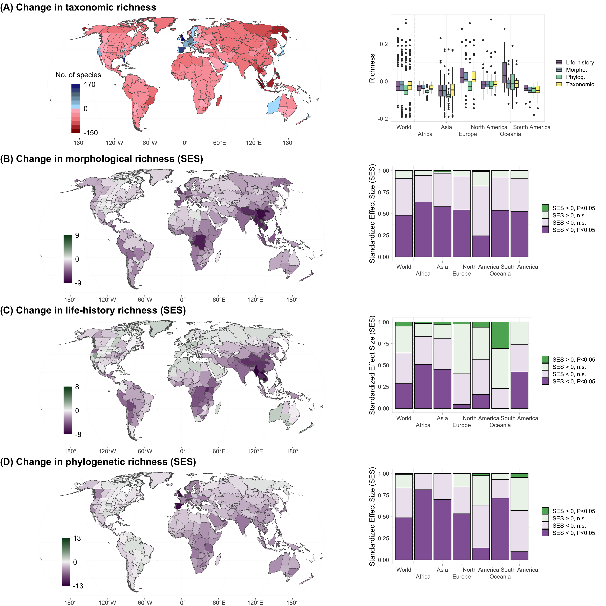
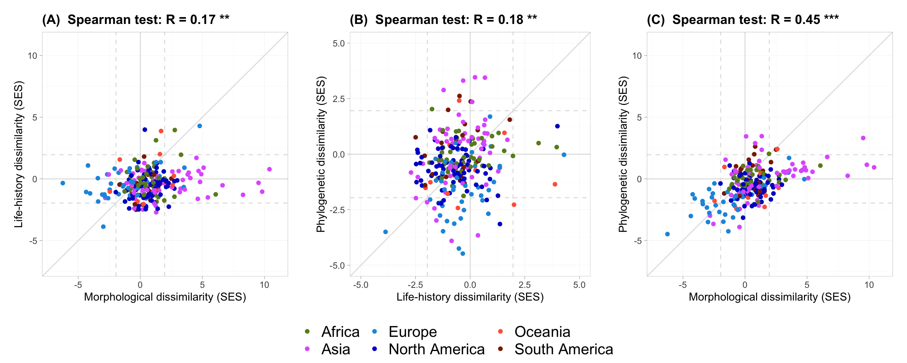
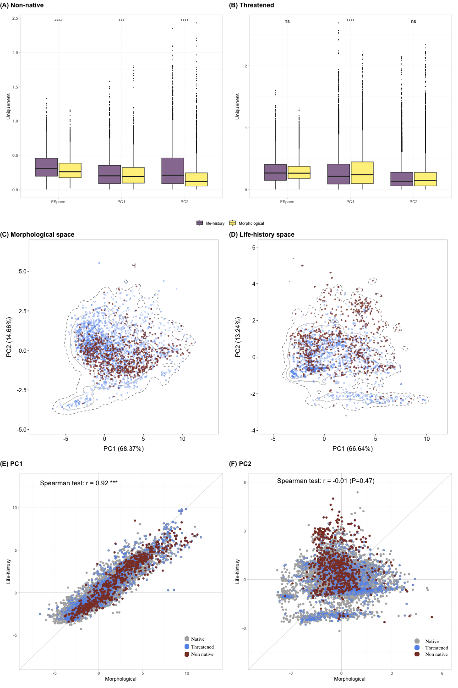

```{r setup, include=FALSE}
knitr::opts_chunk$set(echo = FALSE)
```

## References

Read the full paper <a href="" target="_blank">here</a>

*Citation:* **Toussaint A.**, Pärtel M., Carmona C.P., 2024 Contrasting impacts of non-native and threatened species on morphological, life-history, and phylogenetic diversity in bird assemblages, *Ecology Letters*, Accepted

## Context

The composition of assemblages worldwide has been strongly modified by human activities throughout the introduction of non-native and the extirpation of threatened species. Those changes not only affected the number of species but also the functional and phylogenetic structure of the communities, which might affect the ecosystem functioning. However, it is still unclear whether non-native species could compensate for the potential loss of threatened species and hence maintain ecosystem functioning.

## Aims

Here we tested whether bird non-natives species are functionally and/or phylogenetically similar (i.e., compensation hypothesis) or distinct (i.e., shift hypothesis) from threatened species on bird assemblages in 281 regions worldwide.

## Main findings

Our findings indicate that shifts in species composition could trigger a global decline in avian biodiversity due to the high number of threatened species. Furthermore, these losses are not random; they disproportionally involve species that are functionally and phylogenetically unique at the regional scale. Our results show that non-native species are not able to offset these changes because they are morphologically and phylogenetically close to native fauna. Consequently, our results emphasize the need for both controlling non-native species and preserving phylogenetically unique native species, which are the primary drivers of changes in the functional and phylogenetic structure of bird communities. These findings contribute to our understanding of the complex dynamics shaping global biodiversity and inform conservation strategies.

```{r echo=FALSE, out.width='100%', fig.cap="Changes in taxonomic, morphological, life-history, and phylogenetic richness in 281 regions across the world."}

```

## Methodological novelty

To provide a more nuanced understanding of functional diversity, we distinguished morphological from life-history traits.

Functional diversity is a multi-faceted concept that encompasses a range of traits affecting species' roles in ecosystems. Traditionally, studies have aggregated traits into a single measure of functional diversity. We adopted a different approach by dissecting functional diversity into two morphological diversity and life-history diversity.

We collected 11 morphological traits from the AVONET database for 9,981 species (<a href="https://onlinelibrary.wiley.com/doi/10.1111/ele.13898" target="_blank">Tobias et al. 2022</a>) relative to beak length (Culmen and Nares), width, and depth, tarsus length, wing length, Kipps distance, hand-wing index, tail length, secondary, and body mass (Table S1). These traits influence various ecological functions like seed dispersal, predation, and resource utilization (<a href="https://www.sciencedirect.com/science/article/abs/pii/S0169534706000334" target="_blank">McGill et al. 2006</a>).

Eight life-history traits were retrieved from the AMNIOTE database for 8,940 species (<a href="https://esajournals.onlinelibrary.wiley.com/doi/abs/10.1890/15-0846R.1" target="_blank">Myhrvold et al. 2015</a>): clutch size, number of clutches per year, incubation time, longevity, fledging age, egg mass and distance from the tip of the beak to the opening of the cloaca and body mass (Table S1).

The changes in species composition led to deeper variations in morphological dissimilarity and phylogenetic dissimilarity (r = 0.45, P \< 0.001, Fig. 2A) than in life-history dissimilarity, which showed only a weak correlation with other diversity facets (r \< 0.20, P \< 0.01, Fig. 2B, C). For instance, in Asia, the decrease in morphological dissimilarity was lower-than-expected in 37% of regions while the life-history dissimilarity was not significant. In contrast, in Western Europe, 36% of the regions experienced a decrease lower-than-expected in morphological dissimilarity but not in life-history dissimilarity.

```{r echo=FALSE, out.width='100%', fig.cap="Correlation between standardized effect sizes between morphological, life-history, and phylogenetic dissimilarity."}

```

The observed discrepancies between morphological and life-history traits can be attributed to the distribution of species within the morphological and life-history spaces (Fig. 3). Indeed, non-native species were more distant from native fauna in terms of life-history traits than morphological traits, with these differences being especially pronounced along the PC2 axis. This accounted for the higher-than-expected losses observed in life-history richness but also for the higher-than-expected decrease in dissimilarity for morphological traits. Conversely, for threatened species, we did not observe significant differences between the two sets of traits in the functional spaces and PC2 and even slightly higher for PC1 in morphological traits, explaining higher congruence in patterns for threatened species.

```{r echo=FALSE, out.width='100%', fig.cap="Functional uniqueness of non-native and threatened species between morphological and life-history traits."}

```
