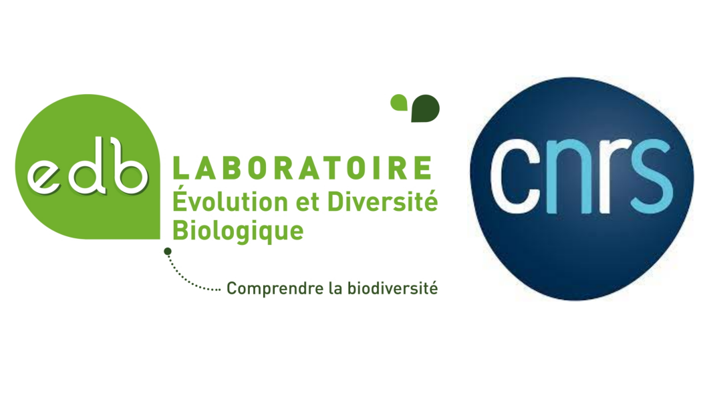

```{r setup, include=FALSE}
knitr::opts_chunk$set(echo = FALSE)
```

I am thrilled to announce that I got a position as a CNRS researcher in 'Laboratoire Écologie & Diversité Biologique' (UMR5174), Toulouse, France. I will start on February, 1st 2024. 

I have been hired as researcher on macroecology and functional biogeography topics.

```{r echo=FALSE, out.width='100%'}

```