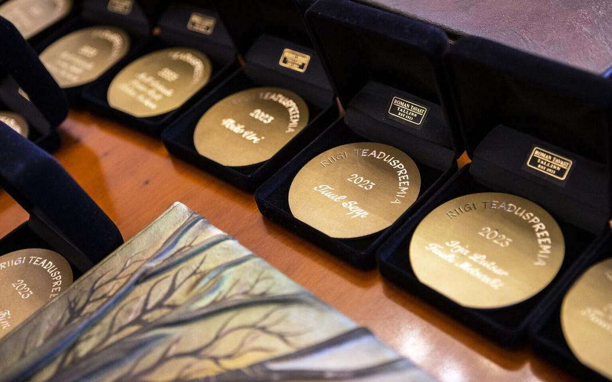

```{r setup, include=FALSE}
knitr::opts_chunk$set(echo = FALSE)
```

```{r echo=FALSE, out.width='100%', fig.cap="Riigi teaduspreemiate pidulik üleandmine 2023. aastal. Autor/allikas: Birgit Püve"}

```

I am very proud and happy to belong to the team led by Carlos P. Carmona, Dr. Riin Tamme and Pr Meelis Pärtel and being awarded by Estonia for our recent research findings !! Nothing would have been possible without the Estonian Research Center who support my resaerch during 7 years.  I also do not forget that Guillermo Bueno was fully part of this project. 

We received this award for our research on the functional diversity of plants and vertebrates at global scale. This project was develop around several scientific papers published in top-level journals. Among the high diversity of papers published, I can recommend to read the papers published in Sciences Advances and Nature Communications. In those papers we investigated the diversity of functional traits for each group of vertebrates and plants at global and regional scales. 

Several associate papers have been published and might interested people to dig more deeply on the world of functional diversity and trait-based approach.

Learn more about Estonian Research Award at <https://novaator.err.ee/1609246851/teaduse-elutoopreemiad-palvisid-jakob-kubarsepp-ja-raivo-uibo>.


