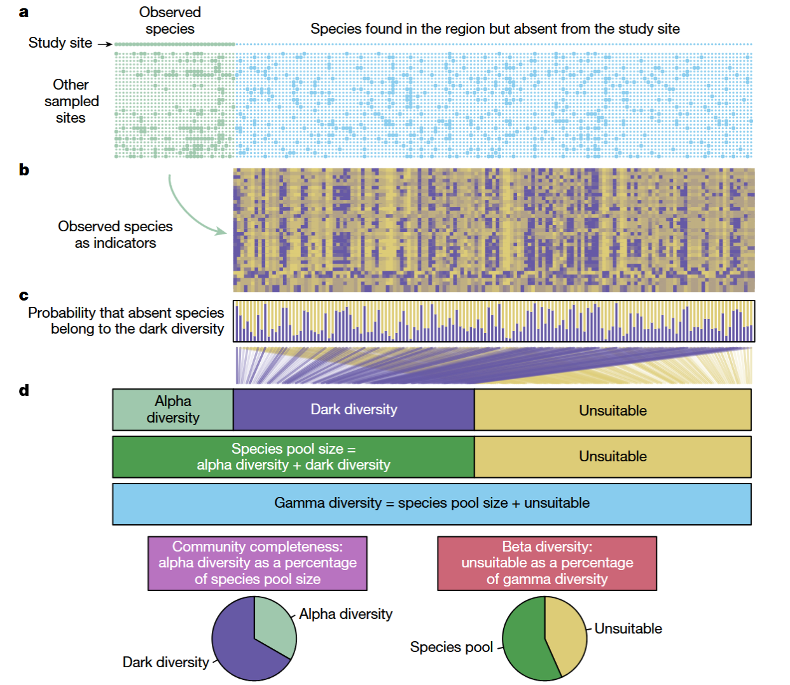
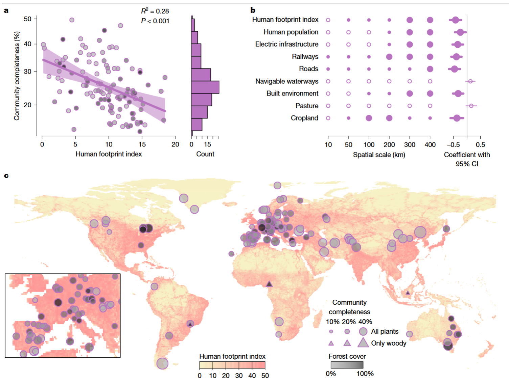

```{r setup, include=FALSE}
knitr::opts_chunk$set(echo = FALSE)
```
## References

🔗 You can read the full open-access article here: [https://www.nature.com/articles/s41586-025-08814-5](https://www.nature.com/articles/s41586-025-08814-5)

*Citation:* Partel M., Tamme R., ..., **Toussaint, A.**, ..., Zobel, M. Global impoverishment of natural vegetation revealed by dark diversity. *Nature*

## Context

🔍 This work brings a new perspective on how we evaluate biodiversity loss by focusing not only on the species present in a community, but also on those that are ecologically suitable yet missing. It shows that even ecosystems that appear “natural” often host only a fraction of the species they could theoretically support.

Together with an amazing group of collaborators, led by M. Partel from my former University of Tartu in Estonie, we combined global occurrence data and ecological niche modelling to estimate the potential and observed diversity of vascular plants worldwide. We then quantified the proportion of ‘missing’ species for more than 5,000 plant communities over the world.

```{r echo=FALSE, out.width='100%', fig.cap="How to estimate dark diverstity (From Partel et al. 2025)"}

```

## Key findings:
- Most ecosystems are far from their potential diversity: in many human-impacted regions, only 20–25% of the suitable species are actually present.
- Dark diversity is particularly high in temperate regions and biodiversity hotspots affected by agriculture and urbanization.
- Human activities not only reduce biodiversity directly, but also prevent recolonization and natural recovery of ecosystems.

```{r echo=FALSE, out.width='100%', fig.cap="How to estimate dark diverstity (From Partel et al. 2025)"}

```

🌱 These results challenge current approaches to conservation. We argue that protecting biodiversity requires not only preserving what remains, but also restoring what is missing. This means integrating ecological potential and landscape connectivity into conservation planning.

📢 A French press release is also available on the CNRS website: [La diversité fantôme ou “dark diversity” révèle l’impact mondial des activités humaines sur la biodiversité](https://crbe.cnrs.fr/la-diversite-fantome-ou-dark-diversity-revele-limpact-mondial-des-activites-humaines-sur-la-biodiversite/)

A big thank you to all my co-authors and collaborators for making this study possible. I'm particularly proud to have contributed to the interpretation of biodiversity patterns and conservation implications. More to come soon on how we can apply this framework to orther type of communities!
