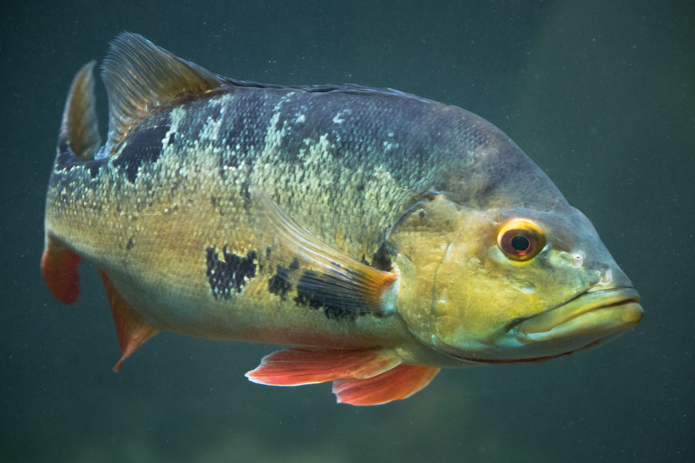

```{r setup, include=FALSE}
knitr::opts_chunk$set(echo = FALSE)
```

```{r cover, out.width='100%', fig.cap="*Cichla* sp. — one of the iconic predatory cichlids of the Guiana Shield rivers."}

```

## The INTRAIT project

Most of what we know about functional diversity in freshwater fish rests on a simple assumption: that a species can be summarised by a single set of trait values. A *Hoplias malabaricus* is a *Hoplias malabaricus* everywhere — same body depth, same eye size, same relative fin length.

That assumption is almost certainly wrong, and the INTRAIT project is designed to find out by how much.

**Intraspecific trait variability (ITV)** refers to the morphological, physiological and behavioural differences that exist between individuals of the same species. In highly diverse tropical assemblages — where dozens of species co-occur across a wide range of habitat types — this within-species variation can be substantial. Ignoring it may systematically bias our estimates of functional diversity, particularly in ecosystems under threat.

The core questions of INTRAIT are:

- Does intraspecific morphological variation exist and how large is it in Neotropical freshwater fishes?
- Does this variation differ across sites along a gradient of anthropogenic pressure?
- How much does ignoring ITV bias community-level estimates of functional diversity?

## The team

The November 2025 mission brought together three people from [CRBE](https://crbe.cnrs.fr/) (Toulouse) along the Maroni river:

- **Sébastien Brosse** — Professor, Université de Toulouse
- **Aurèle Toussaint** — Researcher (CR), CNRS
- **Pierre Bouchet** — PhD student

Back in Toulouse, **Pierre Bertrand** (M2 intern, CRBE) took charge of the image analysis pipeline.

## Itinerary: up the Maroni

The Maroni river forms the western border between French Guiana and Suriname, flowing north from the Tumucumaque highlands to the Atlantic coast. We based ourselves in **Maripasoula** — the administrative centre of the upper Maroni, accessible only by plane from Cayenne — and worked our way upriver across four sampling sites:

1. **Maripasoula** — the most accessible site, with some degree of local human activity
2. **Antecume** — a Wayana Amerindian village further upstream
3. **Apsik Icholi** — a more remote site, lower human pressure
4. **Saut-Lavaud** — the most isolated site, reference conditions

This gradient from relatively impacted to near-pristine is central to the project design: it allows us to test whether fish morphology — and its intraspecific variance — responds to anthropogenic pressure.

## Data collection

Fish were sampled using four complementary techniques, chosen to maximise taxonomic and habitat coverage:

- **Cast net** (*épervier*) — effective in open, shallow waters
- **Gill net** — targeting mid-water and larger-bodied species
- **Dip net** (*épuisette*) — for marginal habitats and small-bodied species
- **Line fishing** — for larger predators reluctant to enter nets

All captured fish were anaesthetised using clove oil, measured on the spot, then photographed in standardised lateral position for downstream morphometric analysis. When the sampling method permitted it — cast net and dip net in particular — fish were released alive after measurement.

```{r, out.width='100%', fig.cap="Cast net fishing (*épervier*) at one of the sampling sites on the Maroni."}
# knitr::include_graphics("casting.jpeg")  # add photo if available
```

## What we measured

Morphological traits follow the **FishMORPH** protocol — the same set of 10 standardised measurements used to build the global FishMORPH database (Brosse et al. 2021, *GEB*). These include body length and depth, head dimensions, eye size, fin positions, and caudal peduncle shape. Together they capture the functional design of a fish: how it moves through the water column, what it eats, and where it forages.

The logic is straightforward: a downward-facing mouth with barbels signals a benthic feeder that roots through the substrate. A streamlined body and forked caudal fin signals an active open-water predator. Morphology encodes ecology — and intraspecific variation in morphology may encode ecological flexibility.

Among the species captured, two deserve mention for their morphological distinctiveness:

- ***Crenicichla multispinosa*** — a pike cichlid, elongated and laterally compressed, with a large terminal mouth
- ***Hemiancistrus medians*** — an armoured suckermouth catfish, entirely benthic, with a ventrally positioned mouth and bony scutes instead of scales
- ***Metaloricaria paucidens*** — another loricariid, with striking elongated body armour

## Results at a glance

| | |
|---|---|
| **Sites** | 4 (Maripasoula, Antecume, Apsik Icholi, Saut-Lavaud) |
| **Species** | ~76 |
| **Individuals** | 1,408 |
| **Measurements per individual** | 10 |
| **Total measurements** | **14,080** |

## Back in the lab

The 1,408 individuals photographed in the field are now being processed by Pierre Bertrand in Toulouse. Each lateral photograph is analysed to extract the 10 FishMORPH measurements using a semi-automated landmarking approach.

Once complete, the dataset will be used for two types of statistical analysis:

1. **Within-species variance decomposition** — how much of the total morphological variation is between species versus within species, and does this ratio differ across sampling sites?
2. **Gradient analysis** — does intraspecific morphological variation increase or decrease along the anthropisation gradient, and which traits are most responsive to human pressure?

The results will directly feed into the broader INTRAIT framework, which aims to reassess global estimates of functional diversity in freshwater fishes once intraspecific variability is properly accounted for.

## Acknowledgements

This mission was funded by **Labex CEBA** (Centre d'Étude de la Biodiversité Amazonienne) and the **Université de Toulouse**. We thank the local communities along the Maroni for their hospitality and logistical support, without which fieldwork at this scale would be impossible.

---

*Maroni river, French Guiana — November 2025*
