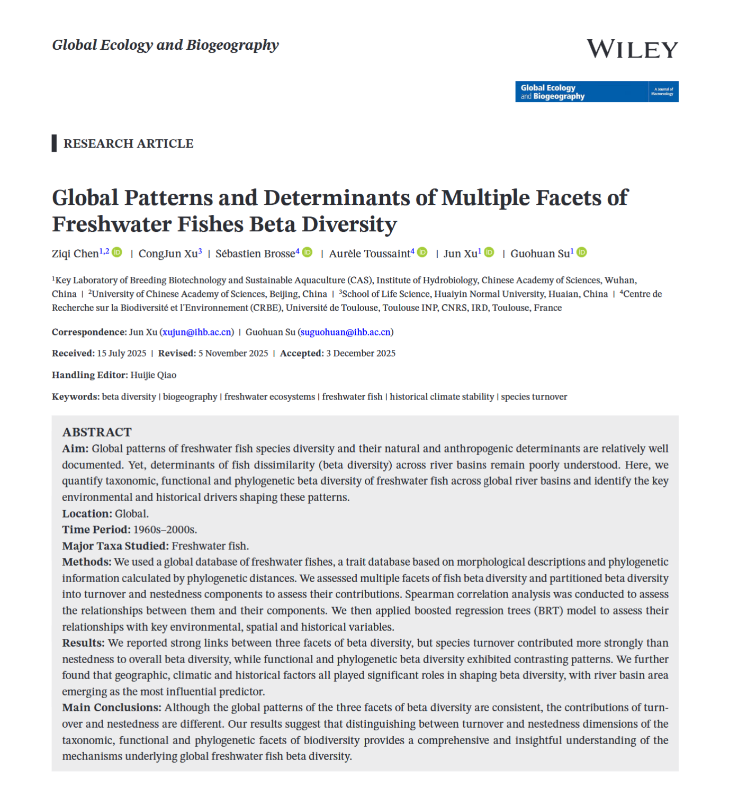

```{r setup, include=FALSE}
knitr::opts_chunk$set(echo = FALSE)
```

## Reference

🔗Read the full paper <a href="https://onlinelibrary.wiley.com/doi/10.1111/geb.70181">here</a>

*Citation:* Chen Z., Xu C., Brosse S., **Toussaint, A**, Xu J., Su G. Global Patterns and Determinants of Multiple Facets of Freshwater Fishes Beta Diversity. *Global Ecology and Biogeography*

```{r echo=FALSE, out.width='100%', fig.cap=""}

```

## Looking Beyond Species Lists: Three Facets of Beta Diversity

Beta diversity captures how different biological communities are from one another. Traditionally, this has been measured using taxonomic beta diversity, which focuses on species identities alone. However, species differ not only in their names, but also in their ecological roles (functional traits) and evolutionary histories (phylogeny).

In this study, we simultaneously quantified:

-   Taxonomic beta diversity (TBD) – differences in species composition,

<!-- -->

-   Functional beta diversity (FBD) – differences in trait composition linked to feeding and locomotion,

-   Phylogenetic beta diversity (PBD) – differences in evolutionary lineages.

Crucially, we further decomposed each facet into two fundamental components:

-   Turnover, reflecting species (or traits or lineages) replacement between basins,

-   Nestedness, reflecting differences driven by richness gradients, where species-poor assemblages are subsets of richer ones.

This decomposition allows us to move beyond patterns and start inferring processes.

## A Consistent Global Pattern, With Important Nuances

At the global scale, the three facets of beta diversity exhibit remarkably consistent spatial patterns. All decline from low to high latitudes, with the highest beta diversity concentrated in tropical regions, confirming earlier findings for taxonomic diversity and extending them to functional and phylogenetic dimensions.

However, beneath this apparent consistency lie important differences. Taxonomic beta diversity is predominantly driven by turnover. This reflects the strong isolation of river basins and the limited dispersal abilities of freshwater fishes, leading to sharp species replacement across space. In contrast, functional and phylogenetic beta diversity are largely dominated by nestedness. In many regions, neighbouring basins share similar ecological strategies and evolutionary lineages, but differ in how many of them are present. In other words, species may change from one basin to another, yet their functional roles remain surprisingly similar. This result highlights a key message: species turnover does not necessarily imply functional or evolutionary turnover.

## When Facets Decouple: Functional Diversity Tells a Different Story

Although the three facets of beta diversity are positively correlated, they are far from redundant. Taxonomic and phylogenetic beta diversity are almost perfectly aligned, reflecting their shared evolutionary basis. Functional beta diversity, however, shows markedly weaker correlations with both.

This decoupling likely arises from functional convergence: distantly related species can evolve similar morphologies and ecological roles when exposed to comparable environmental constraints. As a result, communities may differ taxonomically while remaining functionally similar.

From a conservation perspective, this finding is critical. Protecting species diversity alone may not guarantee the preservation of ecological functions—especially in freshwater systems where redundancy and convergence are common.

## What Drives Global Beta Diversity in Freshwater Fish?

To identify the mechanisms shaping these patterns, we combined global biodiversity data with climatic, geographic, and historical variables using boosted regression trees. No single driver dominates. Instead, beta diversity emerges from the interplay of:

-   River basin area, the strongest predictor across all facets,

-   Contemporary climate, particularly precipitation regimes,

-   Historical climate stability, especially Late Quaternary climate-change velocity,

-   Geographical structure, including basin isolation and slope.

Larger basins tend to harbour more diverse and functionally richer assemblages, leading to strong nestedness patterns in neighbouring, smaller basins. Regions that experienced stable climates over evolutionary timescales often retain unique lineages and trait combinations, reinforcing beta diversity at large spatial scales

## Why This Matters

Freshwater fishes are declining faster than most other vertebrates, yet conservation planning still relies heavily on species counts. Our results demonstrate that different facets of biodiversity respond to different processes, and that ignoring turnover and nestedness can obscure the mechanisms driving biodiversity change.

By integrating taxonomic, functional, and phylogenetic perspectives—and explicitly separating their components—this study provides a more mechanistic understanding of how freshwater biodiversity is structured worldwide. Such insights are essential if we aim to conserve not only species, but also the ecological functions and evolutionary history they represent.
