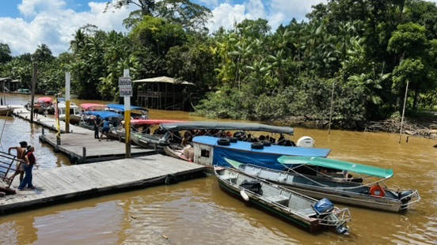

```{r setup, include=FALSE}
knitr::opts_chunk$set(echo = FALSE)
```

I just landed back in Toulouse after three weeks in Belém, Brazil — the capital of Pará state, sitting at the mouth of the Amazon river. I was there to teach a short course on functional ecology and R to a group of graduate students. This is a brief field note, mostly for myself, but also for anyone curious about what it looks like to bring this kind of methodology into a context where biodiversity is not an abstraction.

## The city

```{r, echo=FALSE, out.width='100%', fig.cap="Belém, Pará — May 2026"}

```

Belém is loud, hot, and extraordinarily alive. The market of Ver-o-Peso — one of the largest open-air markets in Latin America — is a crash course in Neotropical biodiversity before you even open a laptop. Dozens of fish species you've never seen, plants with no common name in any European language, fruits that taste like the colour green. For someone who works on functional trait databases, it is a slightly surreal experience: here is the actual material, ungutted and unencoded.

The city itself sits at the confluence of the Guamá river and the Baía do Marajó, and the humidity is a physical presence. Fieldwork clothes are wet before you reach the field.

## The course

The course ran over five days, covering the basics of R for data manipulation and multivariate analysis, then moving into functional diversity: trait spaces, PCoA, TPD estimation. The students came from ecology, conservation biology, and ichthyology programmes — a good mix, with strong motivation and surprisingly little patience for poorly documented functions (fair enough).

Teaching in a context where many of the study organisms are local species — Amazonian fishes, birds of the Atlantic Forest — makes the abstractions land differently. When someone in the room is doing their PhD on a species you have in your trait database, the distance between the data and the thing collapses.

A few things I take back:

- **The Neotropics concentration problem is not abstract here.** We spent a session on global patterns of functional diversity in freshwater fishes. The fact that >75% of global functional diversity is concentrated in this region is something students feel, not just read. Several already work on species that represent unique corners of morphospace with no functional analogues elsewhere.
- **Intraspecific variation matters more than I emphasise in my courses in France.** The students pushed back on the assumption of species-level mean traits very quickly, and rightly so. In highly diverse Amazonian assemblages, within-species variation in traits like gape width or fin shape can be as large as between-species variation in temperate systems. The INTRAIT project feels more urgent after this week.
- **Data availability is genuinely uneven.** Several students are working on species with almost no trait data. The tools I teach assume a relatively well-characterised fauna. That assumption doesn't hold at the Neotropical frontier, and I need to think harder about how to teach imputation and data gap strategies more centrally.

## A note on the privilege of this work

There is something strange about flying from Toulouse — where we have a long tradition of museum collections, curated databases, and computational infrastructure — to teach data-driven ecology in a place where the biodiversity those databases were built to describe actually lives. The flow of information has historically gone in one direction. I don't have a neat resolution to that observation, but I think it is worth naming.

The students I worked with are producing first-rate science under resource constraints that most European labs would find unworkable. The work is good, the questions are sharp, and the local knowledge embedded in their research is something no global database can substitute for.

## What's next

The course materials are available on my website under [Teaching → Trait-based courses](../../Courses.html). I'm also working on a more complete version of the R tutorial tailored to Neotropical fish assemblages, which I hope to release before the end of the year.

Thanks to the local organisers for the invitation and the extraordinarily patient logistics. And to the student who brought homemade tucupi sauce on the last day — that was the highlight of the trip.

---

*Belém, Pará — May 2026*
