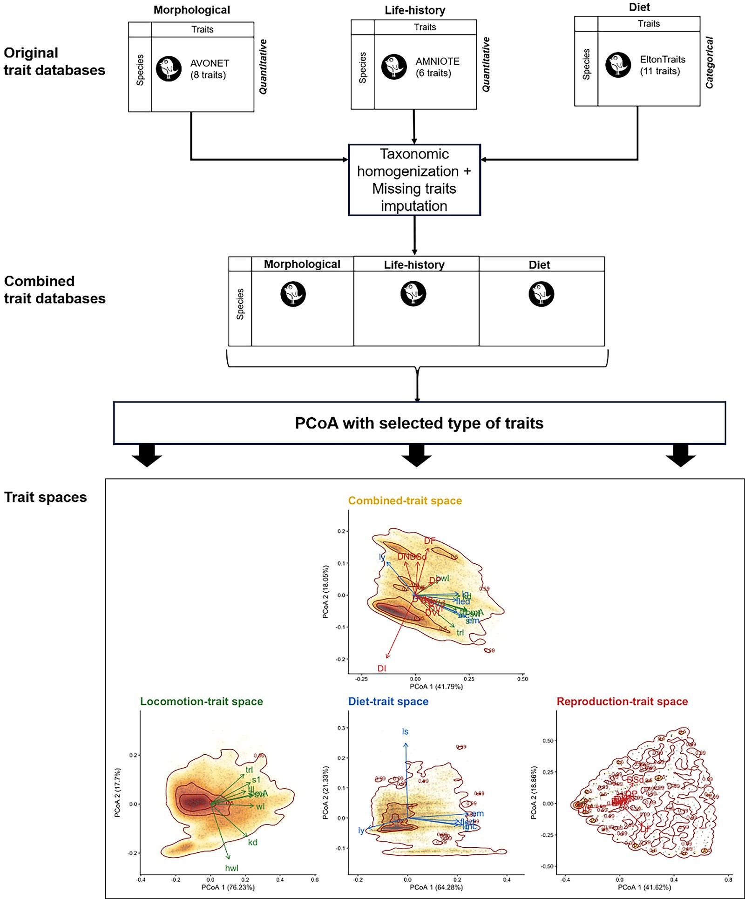
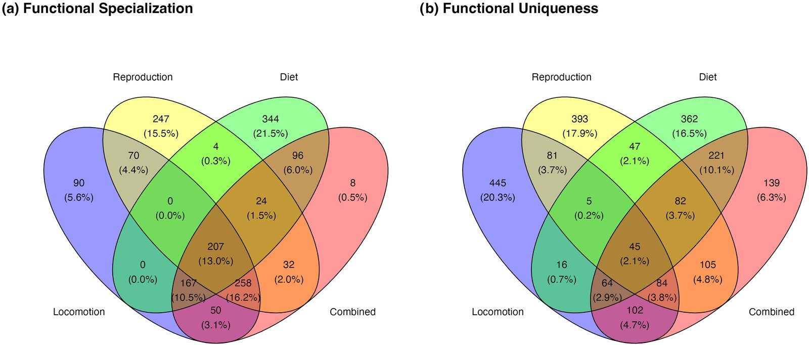
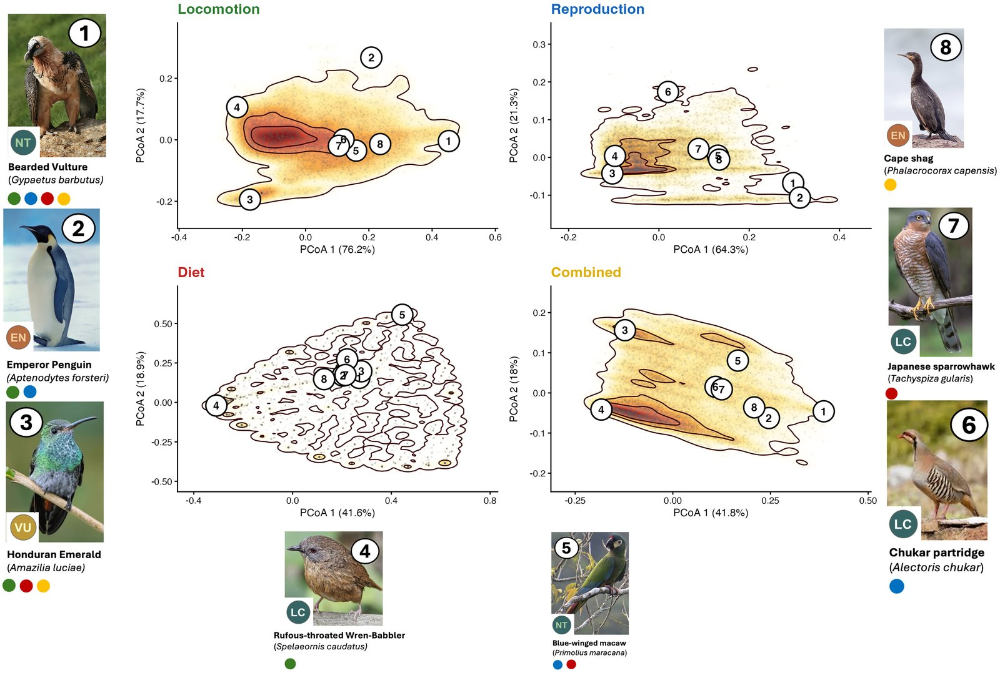

```{r setup, include=FALSE}
knitr::opts_chunk$set(echo = FALSE)
```

## Reference

🔗 Read the full open-access paper <a href="https://doi.org/10.1002/ecog.08578">here</a>

*Citation:* **Toussaint A.**, Tedesco P.A., Grenouillet G., Kasari-Toussaint L., Brosse S. (2026). Disentangling functional spaces: a multidimensional framework for ecology and conservation. *Ecography*, 2026: e08578. <https://doi.org/10.1002/ecog.08578>

## The problem with a single functional space

The functional space has become a central tool of trait-based ecology. We measure a set of traits, compute distances between species, ordinate them, and then derive indices such as functional richness, uniqueness or specialization. In most studies, all available traits (morphology, life history, diet) are pooled into one multivariate space.

This rests on an assumption that is rarely stated explicitly: that these traits are *commensurable*, i.e. that one unit of variation in wing length carries the same ecological meaning as one unit of variation in clutch size or dietary specialization. In practice, pooling traits weights each ecological dimension by its statistical variance rather than by its ecological relevance. Size-related axes dominate, and trophic or reproductive strategies are compressed into secondary axes, or diluted altogether.

We therefore propose a modular alternative: **function-related trait spaces**, each built from traits describing one ecological function, here locomotion, reproduction and diet, analysed side by side with the classic combined space.

```{r echo=FALSE, out.width='100%', fig.cap="Framework used to build function-related trait spaces from three global databases (AVONET, AMNIOTE, EltonTraits) and to compare them with the combined trait space (Toussaint et al. 2026, Fig. 1, CC BY 4.0)."}

```

## What we did

We compiled morphological traits from AVONET, life-history traits from AMNIOTE and diet data from EltonTraits for more than 10,000 bird species (8,413 species in the final integrated dataset). Missing values were imputed with *missForest*, including phylogenetic eigenvectors. Each trait space was built with a PCoA on a mixed-variable Gower distance, in which each block of traits contributes equally.

For each space, we then identified the 10% most functionally distinct species, using two complementary metrics: **functional uniqueness** (FUn, global isolation within the species pool) and **functional specialization** (FSp, distance to the five nearest functional neighbours). Finally, we compared the identities, families and IUCN status of these species across spaces.

## Key findings

- **The ecological dimensions really are distinct.** A confirmatory factor analysis with three latent factors (locomotion, reproduction, diet) fitted the data far better than a single-factor model (Δχ² = 1862.9, df = 3, *p* < 0.001), which showed poor fit (RMSEA = 0.29).
- **The combined space is essentially a size and pace-of-life gradient.** Its first axis was almost entirely explained by morphological and life-history traits (R² = 0.98 and 0.79), much less by diet (R² = 0.60). Well-known ecological patterns, such as the triangular structure of avian trophic niches, disappear once all traits are pooled.
- **Functional distinctiveness is dimension-specific.** Only 207 species (13%) were consistently identified as highly specialized, and only 45 (2.1%) as highly unique, across all four spaces. Each function-related space instead highlighted its own set of unique species (445 for locomotion, 393 for reproduction, 362 for diet), compared with 139 for the combined space alone. Overall, the combined space overlooks more than 800 species that are unique in at least one function-related space.

```{r echo=FALSE, out.width='100%', fig.cap="Overlap of the top 10% most functionally specialized (a) and unique (b) bird species across the four trait spaces (Toussaint et al. 2026, Fig. 2, CC BY 4.0)."}

```

- **Different spaces point to different clades.** Hummingbirds (Trochilidae) and raptors (Accipitridae) stand out in the diet space, ducks and geese (Anatidae) and gamebirds (Phasianidae) in the reproduction space, and hummingbirds again in the locomotion space, driven by hovering flight. The combined space blurs these signals and spreads distinctiveness more evenly across families.
- **Unique species are more threatened.** While 81% of all species are listed as Least Concern, this proportion drops to 64–72% among functionally unique species. Vulnerable, Endangered and Critically Endangered species account for 15–25% of the unique assemblages, nearly twice their proportion in the global avifauna.

```{r echo=FALSE, out.width='100%', fig.cap="Positions of functionally distinct species in the locomotion, reproduction, diet and combined trait spaces, with their IUCN status. Coloured dots indicate the spaces in which each species is functionally distinct (Toussaint et al. 2026, Fig. 5, CC BY 4.0)."}

```

The figure above illustrates the point. The bearded vulture *Gypaetus barbatus* is an outlier in locomotion space, the cape shag *Phalacrocorax capensis* and the chukar partridge *Alectoris chukar* sit at opposite ends of the reproduction space, and the Honduran emerald *Amazilia luciae* and the blue-winged macaw *Primolius maracana* are trophic specialists. In the combined space, most of them converge towards its central region.

## Why this matters

Functionally unique species are those whose loss cannot be buffered by functional redundancy. Yet their identification depends critically on how the functional space is built. Conservation tools that rely on a combined space, such as the FUSE index or functional vulnerability frameworks, may systematically miss species whose uniqueness is expressed in a single ecological dimension, which are precisely the species whose loss would produce the most idiosyncratic and irreversible functional changes.

The framework does not replace existing approaches; it complements them. It is also modular: as global databases grow to include colouration, acoustic or behavioural traits, new function-related spaces can be added, each anchored to a defined ecological function.

## Data and code

All R scripts and processed data are available on GitHub ([FunTraits/DisentFunSpaces](https://github.com/FunTraits/DisentFunSpaces)) and archived on Zenodo ([10.5281/zenodo.21487237](https://doi.org/10.5281/zenodo.21487237)).

Many thanks to my co-authors Pablo Tedesco, Gaël Grenouillet, Liis Kasari-Toussaint and Sébastien Brosse, and to the anonymous reviewers whose comments helped improve the manuscript.
